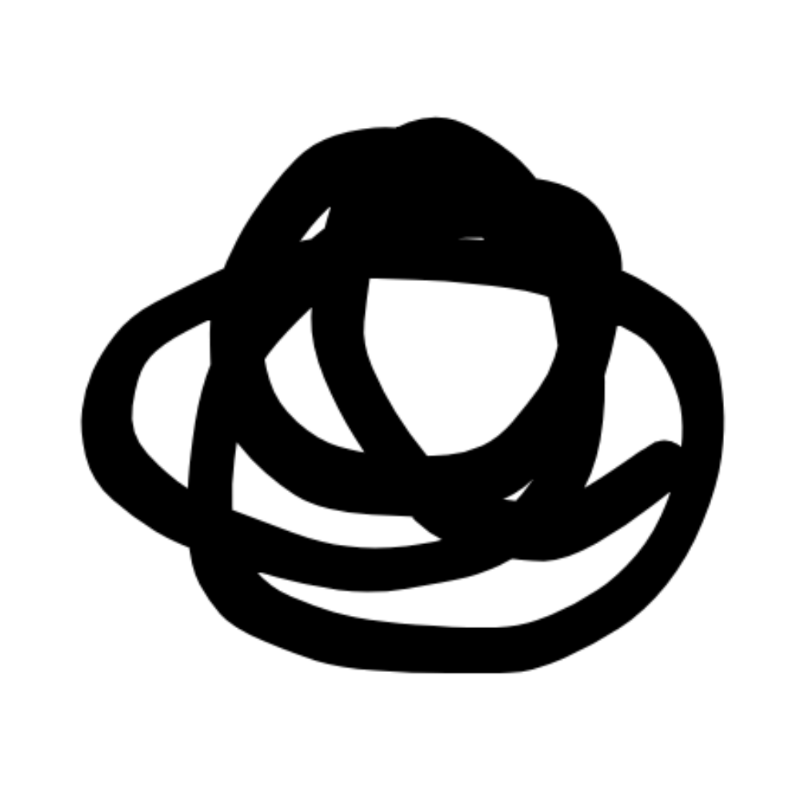

 
 

 

<h3 align="center">Kritzel</h3>

The Infinite Canvas Development Kit

<a href="https://kritzel.io">Website</a>&nbsp;&nbsp;·&nbsp;&nbsp;<a href="https://app.kritzel.io">Live Demo</a>&nbsp;&nbsp;·&nbsp;&nbsp;<a href="https://www.npmjs.com/package/@kritzel/engine">NPM</a>

 
 

# Overview

Kritzel is a toolkit for building infinite-canvas experiences such as whiteboards, visual planning tools, knowledge maps, and collaborative spatial workspaces.

It gives you a framework-neutral whiteboard foundation for creating interactive, browser-based canvases with objects, tools, navigation, and editing workflows without locking you into a specific UI stack.

## What you can build

- Whiteboards and brainstorming surfaces
- Visual planning and diagram tools
- Spatial knowledge and idea maps
- Collaborative content workspaces

## Repository

This repo contains the Kritzel editor components and demo apps it mirrors from the main Kritzel repository. It is intended for issue tracking and feature requests only. Changes are made in the core repository.