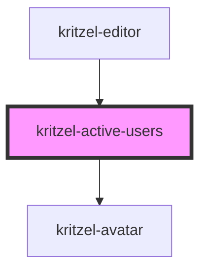

# kritzel-active-users

<!-- Auto Generated Below -->

## Properties

| Property     | Attribute     | Description                                                | Type             | Default |
| ------------ | ------------- | ---------------------------------------------------------- | ---------------- | ------- |
| `avatarSize` | `avatar-size` | Avatar size in pixels                                      | `number`         | `40`    |
| `maxVisible` | `max-visible` | Maximum number of avatars to show before overflow text     | `number`         | `3`     |
| `overlap`    | `overlap`     | Overlap offset in pixels (negative margin between avatars) | `number`         | `20`    |
| `users`      | --            | Array of active users to display                           | `IKritzelUser[]` | `[]`    |

## Dependencies

### Used by

 - [kritzel-editor](../kritzel-editor)

### Depends on

- [kritzel-avatar](../kritzel-avatar)

### Graph

----------------------------------------------

*Built with [StencilJS](https://stenciljs.com/)*
