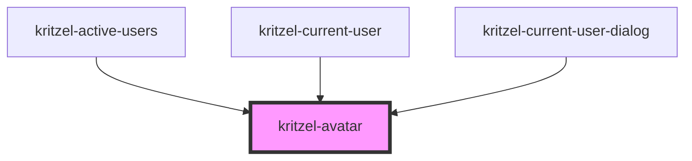

# kritzel-avatar

<!-- Auto Generated Below -->

## Properties

| Property | Attribute | Description                                                   | Type           | Default     |
| -------- | --------- | ------------------------------------------------------------- | -------------- | ----------- |
| `color`  | `color`   | Background color for initials fallback                        | `string`       | `undefined` |
| `name`   | `name`    | Direct prop: user's display name (used for initials fallback) | `string`       | `undefined` |
| `size`   | `size`    | Avatar diameter in pixels                                     | `number`       | `32`        |
| `user`   | --        | Full user object. If provided, individual props are ignored.  | `IKritzelUser` | `undefined` |

## Dependencies

### Used by

 - [kritzel-active-users](../kritzel-active-users)
 - [kritzel-current-user](../kritzel-current-user)
 - [kritzel-current-user-dialog](../kritzel-current-user-dialog)

### Graph

----------------------------------------------

*Built with [StencilJS](https://stenciljs.com/)*
