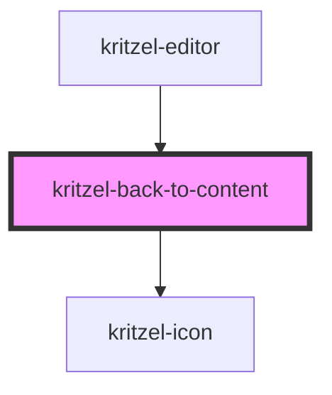

# kritzel-back-to-content

A button component that appears when the user has panned away from all visible content on the canvas. Clicking it navigates the viewport back to the nearest content.

## Usage

```html
<kritzel-back-to-content
  visible={true}
  text="Back to content"
  onBackToContent={() => handleBackToContent()}
></kritzel-back-to-content>
```

## CSS Variables

| Variable | Default | Description |
|----------|---------|-------------|
| `--kritzel-back-to-content-top` | `16px` | Distance from top of container |
| `--kritzel-back-to-content-z-index` | `1000` | Z-index of the button |
| `--kritzel-back-to-content-gap` | `6px` | Gap between icon and text |
| `--kritzel-back-to-content-padding` | `10px 16px` | Button padding |
| `--kritzel-back-to-content-border` | `1px solid #ebebeb` | Button border |
| `--kritzel-back-to-content-border-radius` | `12px` | Button border radius |
| `--kritzel-back-to-content-background-color` | `#ffffff` | Button background color |
| `--kritzel-back-to-content-color` | `#000000` | Button text color |
| `--kritzel-back-to-content-font-size` | `14px` | Button font size |
| `--kritzel-back-to-content-font-weight` | `500` | Button font weight |
| `--kritzel-back-to-content-box-shadow` | `0 0 3px rgba(0, 0, 0, 0.08)` | Button box shadow |
| `--kritzel-back-to-content-hover-background-color` | `hsl(0, 0%, 0%, 4.3%)` | Hover background color |
| `--kritzel-back-to-content-active-background-color` | `hsl(0, 0%, 0%, 8.6%)` | Active/pressed background color |
| `--kritzel-pointer-cursor` | `pointer` | Cursor style |

<!-- Auto Generated Below -->


## Properties

| Property  | Attribute | Description                       | Type      | Default             |
| --------- | --------- | --------------------------------- | --------- | ------------------- |
| `text`    | `text`    | The text to display on the button | `string`  | `'Back to content'` |
| `visible` | `visible` | Whether the button is visible     | `boolean` | `false`             |


## Events

| Event           | Description                        | Type                |
| --------------- | ---------------------------------- | ------------------- |
| `backToContent` | Emitted when the button is clicked | `CustomEvent<void>` |


## Dependencies

### Used by

 - [kritzel-editor](../kritzel-editor)

### Depends on

- kritzel-icon

### Graph


----------------------------------------------

*Built with [StencilJS](https://stenciljs.com/)*
