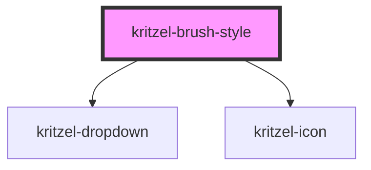

# kritzel-brush-style

<!-- Auto Generated Below -->

## Properties

| Property       | Attribute | Description | Type                     | Default                                                                                         |
| -------------- | --------- | ----------- | ------------------------ | ----------------------------------------------------------------------------------------------- |
| `brushOptions` | --        |             | `BrushStyleOption[]`     | `[     { value: 'pen', label: 'Pen' },     { value: 'highlighter', label: 'Highlighter' },   ]` |
| `type`         | `type`    |             | `"highlighter" \| "pen"` | `'pen'`                                                                                         |

## Events

| Event        | Description | Type                                  |
| ------------ | ----------- | ------------------------------------- |
| `typeChange` |             | `CustomEvent<"highlighter" \| "pen">` |

## Dependencies

### Depends on

- [kritzel-dropdown](../kritzel-dropdown)
- kritzel-icon

### Graph

----------------------------------------------

*Built with [StencilJS](https://stenciljs.com/)*
