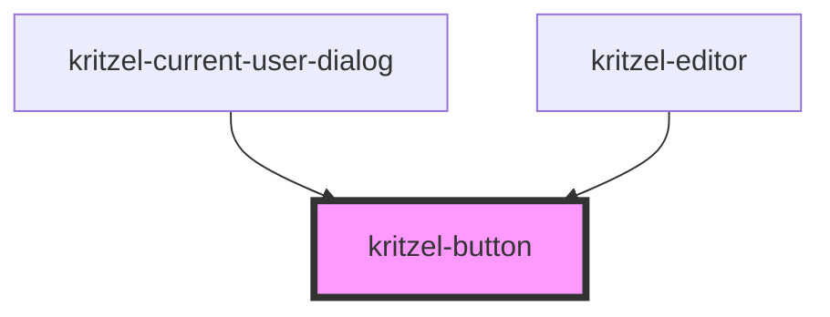

# kritzel-button

<!-- Auto Generated Below -->

## Properties

| Property   | Attribute  | Description                                      | Type                                 | Default     |
| ---------- | ---------- | ------------------------------------------------ | ------------------------------------ | ----------- |
| `disabled` | `disabled` | Whether the button is disabled                   | `boolean`                            | `false`     |
| `type`     | `type`     | The type attribute for the native button element | `"button" \| "reset" \| "submit"`    | `'button'`  |
| `variant`  | `variant`  | The visual variant of the button                 | `"primary" \| "secondary" \| "text"` | `'primary'` |

## Events

| Event         | Description                        | Type                |
| ------------- | ---------------------------------- | ------------------- |
| `buttonClick` | Emitted when the button is clicked | `CustomEvent<void>` |

## Slots

| Slot | Description      |
| ---- | ---------------- |
|      | The default slot |

## Dependencies

### Used by

 - [kritzel-current-user-dialog](../kritzel-current-user-dialog)
 - [kritzel-editor](../kritzel-editor)

### Graph

----------------------------------------------

*Built with [StencilJS](https://stenciljs.com/)*
