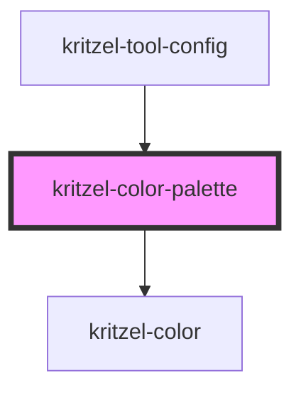

# kritzel-color-palette

<!-- Auto Generated Below -->

## Properties

| Property        | Attribute     | Description | Type                               | Default     |
| --------------- | ------------- | ----------- | ---------------------------------- | ----------- |
| `colors`        | --            |             | `ThemeAwareColor[]`                | `[]`        |
| `isExpanded`    | `is-expanded` |             | `boolean`                          | `false`     |
| `isOpaque`      | `is-opaque`   |             | `boolean`                          | `false`     |
| `opacity`       | `opacity`     |             | `number`                           | `1`         |
| `selectedColor` | --            |             | `ThemeAwareColor`                  | `null`      |
| `theme`         | `theme`       |             | `"dark" \| "light" \| string & {}` | `undefined` |

## Events

| Event         | Description | Type                           |
| ------------- | ----------- | ------------------------------ |
| `colorChange` |             | `CustomEvent<ThemeAwareColor>` |

## Dependencies

### Used by

 - [kritzel-tool-config](../kritzel-tool-config)

### Depends on

- [kritzel-color](../kritzel-color)

### Graph

----------------------------------------------

*Built with [StencilJS](https://stenciljs.com/)*
