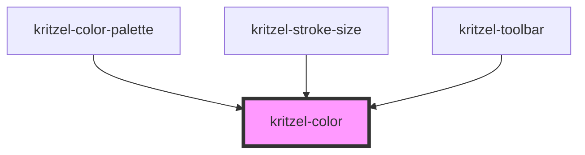

# kritzel-color

<!-- Auto Generated Below -->

## Properties

| Property | Attribute | Description | Type                               | Default     |
| -------- | --------- | ----------- | ---------------------------------- | ----------- |
| `size`   | `size`    |             | `number`                           | `24`        |
| `theme`  | `theme`   |             | `"dark" \| "light" \| string & {}` | `undefined` |
| `value`  | `value`   |             | `ThemeAwareColor \| string`        | `undefined` |

## Dependencies

### Used by

 - [kritzel-color-palette](../kritzel-color-palette)
 - [kritzel-stroke-size](../kritzel-stroke-size)
 - [kritzel-toolbar](../kritzel-toolbar)

### Graph

----------------------------------------------

*Built with [StencilJS](https://stenciljs.com/)*
