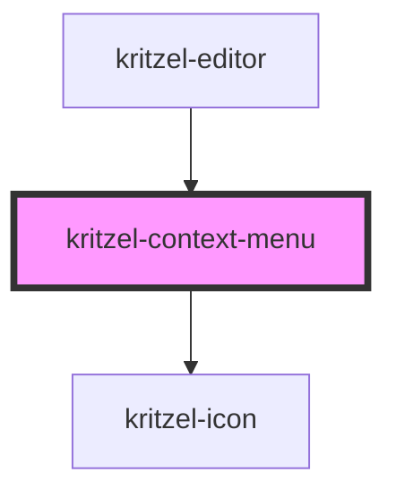

# kritzel-context-menu

<!-- Auto Generated Below -->

## Properties

| Property  | Attribute | Description | Type                                             | Default     |
| --------- | --------- | ----------- | ------------------------------------------------ | ----------- |
| `items`   | --        |             | `ContextMenuItem[]`                              | `undefined` |
| `objects` | --        |             | `KritzelBaseObject<HTMLElement \| SVGElement>[]` | `undefined` |

## Events

| Event            | Description | Type                           |
| ---------------- | ----------- | ------------------------------ |
| `actionSelected` |             | `CustomEvent<ContextMenuItem>` |
| `close`          |             | `CustomEvent<void>`            |

## Dependencies

### Used by

 - [kritzel-editor](../kritzel-editor)

### Depends on

- kritzel-icon

### Graph

----------------------------------------------

*Built with [StencilJS](https://stenciljs.com/)*
