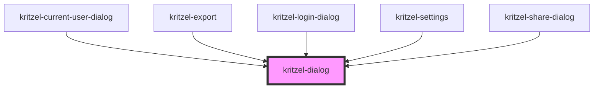

# kritzel-dialog

A generic, reusable dialog component for displaying modal content to the user.

## Features

- **Slots-based content**: Use `header`, default (body), and `footer` slots for flexible content
- **Focus management**: Auto-focus first element and trap focus within the dialog
- **Keyboard support**: Close with Escape key, navigate with Tab
- **Backdrop click**: Optionally close when clicking outside the dialog
- **Scroll lock**: Prevents body scroll when dialog is open
- **Animations**: Smooth fade-in and scale animations
- **Size variants**: Small, medium, and large sizes
- **Accessible**: Proper ARIA attributes for screen readers

## Usage

```html
<kritzel-dialog is-open="true" dialog-title="Confirm Action" size="medium">
  <p>Are you sure you want to proceed?</p>
  <div slot="footer">
    <button>Cancel</button>
    <button>Confirm</button>
  </div>
</kritzel-dialog>
```

### With custom header

```html
<kritzel-dialog is-open="true">
  <div slot="header">
    <h2>Custom Header</h2>
    <span>Subtitle text</span>
  </div>
  <p>Dialog content goes here.</p>
</kritzel-dialog>
```

<!-- Auto Generated Below -->


## Properties

| Property             | Attribute              | Description                                                                            | Type                                             | Default     |
| -------------------- | ---------------------- | -------------------------------------------------------------------------------------- | ------------------------------------------------ | ----------- |
| `autoFocus`          | `auto-focus`           | Whether to auto-focus the first focusable element when opened                          | `boolean`                                        | `true`      |
| `closable`           | `closable`             | Whether to show the close button in the header                                         | `boolean`                                        | `true`      |
| `closeOnBackdrop`    | `close-on-backdrop`    | Whether clicking the backdrop closes the dialog                                        | `boolean`                                        | `true`      |
| `closeOnEscape`      | `close-on-escape`      | Whether pressing Escape closes the dialog                                              | `boolean`                                        | `true`      |
| `contained`          | `contained`            | Constrain the dialog to its nearest editor/container ancestor instead of the viewport. | `boolean`                                        | `false`     |
| `dialogTitle`        | `dialog-title`         | Optional title displayed in the header                                                 | `string`                                         | `undefined` |
| `fullscreenOnMobile` | `fullscreen-on-mobile` | Whether to automatically go fullscreen on mobile viewports                             | `boolean`                                        | `true`      |
| `isOpen`             | `is-open`              | Whether the dialog is open                                                             | `boolean`                                        | `false`     |
| `size`               | `size`                 | Size of the dialog                                                                     | `"fullscreen" \| "large" \| "medium" \| "small"` | `'medium'`  |
| `trapFocus`          | `trap-focus`           | Whether to trap focus within the dialog                                                | `boolean`                                        | `true`      |


## Events

| Event         | Description                    | Type                                    |
| ------------- | ------------------------------ | --------------------------------------- |
| `dialogClose` | Emitted when the dialog closes | `CustomEvent<IKritzelDialogCloseEvent>` |
| `dialogOpen`  | Emitted when the dialog opens  | `CustomEvent<void>`                     |


## Methods

### `close(reason?: KritzelDialogCloseReason) => Promise<void>`


#### Parameters

| Name     | Type                                                         | Description |
| -------- | ------------------------------------------------------------ | ----------- |
| `reason` | `"backdrop" \| "escape" \| "close-button" \| "programmatic"` |             |

#### Returns

Type: `Promise<void>`


### `focusFirstElement() => Promise<void>`


#### Returns

Type: `Promise<void>`


### `open() => Promise<void>`


#### Returns

Type: `Promise<void>`


## Slots

| Slot       | Description      |
| ---------- | ---------------- |
|            | The default slot |
| `"footer"` |                  |
| `"header"` |                  |


## Dependencies

### Used by

 - [kritzel-current-user-dialog](../kritzel-current-user-dialog)
 - [kritzel-export](../kritzel-export)
 - [kritzel-login-dialog](../kritzel-login-dialog)
 - [kritzel-settings](../kritzel-settings)
 - [kritzel-share-dialog](../kritzel-share-dialog)

### Graph


----------------------------------------------

*Built with [StencilJS](https://stenciljs.com/)*
