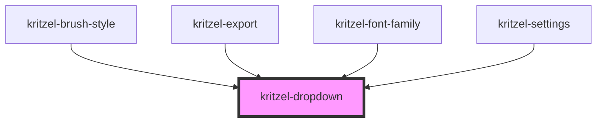

# kritzel-dropdown

<!-- Auto Generated Below -->

## Properties

| Property             | Attribute              | Description                                                                  | Type               | Default     |
| -------------------- | ---------------------- | ---------------------------------------------------------------------------- | ------------------ | ----------- |
| `forceOpenDirection` | `force-open-direction` | Force the dropdown to open in a specific direction instead of auto-detecting | `"down" \| "up"`   | `undefined` |
| `options`            | --                     |                                                                              | `DropdownOption[]` | `[]`        |
| `selectStyles`       | --                     |                                                                              | `string`           | `{}`        |
| `value`              | `value`                |                                                                              | `string`           | `undefined` |
| `width`              | `width`                |                                                                              | `string`           | `undefined` |

## Events

| Event          | Description | Type                  |
| -------------- | ----------- | --------------------- |
| `valueChanged` |             | `CustomEvent<string>` |

## Slots

| Slot       | Description |
| ---------- | ----------- |
| `"prefix"` |             |
| `"suffix"` |             |

## Dependencies

### Used by

 - [kritzel-brush-style](../kritzel-brush-style)
 - [kritzel-export](../kritzel-export)
 - [kritzel-font-family](../kritzel-font-family)
 - [kritzel-settings](../kritzel-settings)

### Graph

----------------------------------------------

*Built with [StencilJS](https://stenciljs.com/)*
