| `objectContextMenuItems`    | --                             |                                                                                                                                                                    | `ContextMenuItem[]`                         | `[     { label: 'menu.copy', icon: 'copy', group: 'clipboard', action: () => this.engineRef.copy() },     { label: 'menu.cut', icon: 'cut', group: 'clipboard', action: () => this.engineRef.cut() },     {       label: 'menu.paste',       icon: 'paste',       group: 'clipboard',       action: (menu, _) => this.engineRef.paste(menu.x, menu.y),     },     {       label: 'menu.export',       icon: 'upload',       group: 'clipboard',       isVisible: (_, objects) => this.canExportObjects(objects),       action: (_, objects) => {         const format = this.getPreferredExportFormat(objects);         if (!format) {           return;         }          void this.engineRef.exportSelectedObject(format);       },     },     {       label: 'menu.order',       icon: 'ordering',       group: 'other',       children: [         { label: 'menu.bringToFront', icon: 'bringToFront', action: () => this.engineRef.bringToFront() },         { label: 'menu.sendToBack', icon: 'sendToBack', action: () => this.engineRef.sendToBack() },         { label: 'menu.moveUp', icon: 'arrowUpFromDot', action: () => this.engineRef.bringForward() },         { label: 'menu.moveDown', icon: 'arrowDownFromDot', action: () => this.engineRef.sendBackward() },       ],     },     {       label: 'menu.align',       icon: 'align',       group: 'other',       children: [         { label: 'menu.alignLeft', icon: 'alignStartVertical', action: () => this.engineRef.alignObjects(KritzelAlignment.StartHorizontal) },         { label: 'menu.alignCenterHorizontal', icon: 'alignCenterHorizontal', action: () => this.engineRef.alignObjects(KritzelAlignment.CenterHorizontal) },         { label: 'menu.alignRight', icon: 'alignEndVertical', action: () => this.engineRef.alignObjects(KritzelAlignment.EndHorizontal) },         { label: 'menu.alignTop', icon: 'alignStartHorizontal', action: () => this.engineRef.alignObjects(KritzelAlignment.StartVertical) },         { label: 'menu.alignCenterVertical', icon: 'alignCenterVertical', action: () => this.engineRef.alignObjects(KritzelAlignment.CenterVertical) },         { label: 'menu.alignBottom', icon: 'alignEndHorizontal', action: () => this.engineRef.alignObjects(KritzelAlignment.EndVertical) },       ],     },     { label: 'menu.group', icon: 'group', group: 'other', action: () => this.engineRef.groupSelectedObjects() },     { label: 'menu.ungroup', icon: 'ungroup', group: 'other', action: () => this.engineRef.ungroupSelectedObjects() },     { label: 'menu.delete', icon: 'delete', group: 'destructive', action: () => this.engineRef.delete() },   ]` |
# kritzel-edito
<!-- Auto Generated Below -->

## Properties

| Property                    | Attribute                      | Description                                                                                                                                                        | Type                                                                                                                                                                                                                                                                                                                                                                                                                                                                                                                                                                                                                                                                                                                                                                                                                                                                                                                                                                                                                             | Default                                                                                                                                                                                                                                                                                                                                                                                                                                                                                                                                                                                                                                                                                                                                                                                                                                                                                                                                                                                                                                                                                                                                                                                                                                                                                                                                                                                                                                                                                                                                                                                                                                                                                                                                                                                                                                                                                                                                                                                                                                                                                                                                                                                                                                                                                                                                                                                                                                                                                                                                                                                                                                                                                                                                                                                                       |
| --------------------------- | ------------------------------ | ------------------------------------------------------------------------------------------------------------------------------------------------------------------ | -------------------------------------------------------------------------------------------------------------------------------------------------------------------------------------------------------------------------------------------------------------------------------------------------------------------------------------------------------------------------------------------------------------------------------------------------------------------------------------------------------------------------------------------------------------------------------------------------------------------------------------------------------------------------------------------------------------------------------------------------------------------------------------------------------------------------------------------------------------------------------------------------------------------------------------------------------------------------------------------------------------------------------- | ------------------------------------------------------------------------------------------------------------------------------------------------------------------------------------------------------------------------------------------------------------------------------------------------------------------------------------------------------------------------------------------------------------------------------------------------------------------------------------------------------------------------------------------------------------------------------------------------------------------------------------------------------------------------------------------------------------------------------------------------------------------------------------------------------------------------------------------------------------------------------------------------------------------------------------------------------------------------------------------------------------------------------------------------------------------------------------------------------------------------------------------------------------------------------------------------------------------------------------------------------------------------------------------------------------------------------------------------------------------------------------------------------------------------------------------------------------------------------------------------------------------------------------------------------------------------------------------------------------------------------------------------------------------------------------------------------------------------------------------------------------------------------------------------------------------------------------------------------------------------------------------------------------------------------------------------------------------------------------------------------------------------------------------------------------------------------------------------------------------------------------------------------------------------------------------------------------------------------------------------------------------------------------------------------------------------------------------------------------------------------------------------------------------------------------------------------------------------------------------------------------------------------------------------------------------------------------------------------------------------------------------------------------------------------------------------------------------------------------------------------------------------------------------------------------- |
| `activeUsers`               | --                             |                                                                                                                                                                    | `IKritzelUser[]`                                                                                                                                                                                                                                                                                                                                                                                                                                                                                                                                                                                                                                                                                                                                                                                                                                                                                                                                                                                                                 | `undefined`                                                                                                                                                                                                                                                                                                                                                                                                                                                                                                                                                                                                                                                                                                                                                                                                                                                                                                                                                                                                                                                                                                                                                                                                                                                                                                                                                                                                                                                                                                                                                                                                                                                                                                                                                                                                                                                                                                                                                                                                                                                                                                                                                                                                                                                                                                                                                                                                                                                                                                                                                                                                                                                                                                                                                                                                   |
| `activeWorkspaceId`         | `active-workspace-id`          | Optional workspace ID to set as active. If provided, the editor will automatically activate the workspace with this ID.                                            | `string`                                                                                                                                                                                                                                                                                                                                                                                                                                                                                                                                                                                                                                                                                                                                                                                                                                                                                                                                                                                                                         | `undefined`                                                                                                                                                                                                                                                                                                                                                                                                                                                                                                                                                                                                                                                                                                                                                                                                                                                                                                                                                                                                                                                                                                                                                                                                                                                                                                                                                                                                                                                                                                                                                                                                                                                                                                                                                                                                                                                                                                                                                                                                                                                                                                                                                                                                                                                                                                                                                                                                                                                                                                                                                                                                                                                                                                                                                                                                   |
| `assetStorageConfig`        | --                             |                                                                                                                                                                    | `KritzelAssetStorageConfig`                                                                                                                                                                                                                                                                                                                                                                                                                                                                                                                                                                                                                                                                                                                                                                                                                                                                                                                                                                                                      | `DEFAULT_ASSET_STORAGE_CONFIG`                                                                                                                                                                                                                                                                                                                                                                                                                                                                                                                                                                                                                                                                                                                                                                                                                                                                                                                                                                                                                                                                                                                                                                                                                                                                                                                                                                                                                                                                                                                                                                                                                                                                                                                                                                                                                                                                                                                                                                                                                                                                                                                                                                                                                                                                                                                                                                                                                                                                                                                                                                                                                                                                                                                                                                                |
| `cursorTarget`              | --                             | The element to use as the target for the cursor. Defaults to the editor container if not set.                                                                      | `HTMLElement`                                                                                                                                                                                                                                                                                                                                                                                                                                                                                                                                                                                                                                                                                                                                                                                                                                                                                                                                                                                                                    | `undefined`                                                                                                                                                                                                                                                                                                                                                                                                                                                                                                                                                                                                                                                                                                                                                                                                                                                                                                                                                                                                                                                                                                                                                                                                                                                                                                                                                                                                                                                                                                                                                                                                                                                                                                                                                                                                                                                                                                                                                                                                                                                                                                                                                                                                                                                                                                                                                                                                                                                                                                                                                                                                                                                                                                                                                                                                   |
| `customFonts`               | --                             | Registers fonts for runtime usage (for example custom object rendering). Text-tool config tooltip options are controlled via toolbarItems[].config.availableFonts. | `{ [x: string]: KritzelFontRegistration; }`                                                                                                                                                                                                                                                                                                                                                                                                                                                                                                                                                                                                                                                                                                                                                                                                                                                                                                                                                                                      | `{}`                                                                                                                                                                                                                                                                                                                                                                                                                                                                                                                                                                                                                                                                                                                                                                                                                                                                                                                                                                                                                                                                                                                                                                                                                                                                                                                                                                                                                                                                                                                                                                                                                                                                                                                                                                                                                                                                                                                                                                                                                                                                                                                                                                                                                                                                                                                                                                                                                                                                                                                                                                                                                                                                                                                                                                                                          |
| `customSvgIcons`            | --                             |                                                                                                                                                                    | `Partial<Record<"info" \| "type" \| "image" \| "download" \| "command" \| "cursor" \| "x" \| "copy" \| "eraser" \| "pen" \| "arrow" \| "arrowUpFromDot" \| "arrowDownFromDot" \| "highlighter" \| "shapes" \| "shapeRectangle" \| "shapeEllipse" \| "shapeTriangle" \| "imageOff" \| "chevronDown" \| "chevronUp" \| "chevronLeft" \| "chevronRight" \| "chevronsLeft" \| "paste" \| "cut" \| "delete" \| "bringToFront" \| "sendToBack" \| "selectAll" \| "upload" \| "undo" \| "redo" \| "plus" \| "minus" \| "ellipsisVertical" \| "check" \| "group" \| "ungroup" \| "moveVertical" \| "hand" \| "handGrab" \| "mousePointer" \| "pointer" \| "settings" \| "share" \| "palette" \| "ordering" \| "layoutTemplate" \| "align" \| "alignStartHorizontal" \| "alignCenterHorizontal" \| "alignEndHorizontal" \| "alignStartVertical" \| "alignCenterVertical" \| "alignEndVertical" \| "viewport" \| "logOut" \| "usersRound" \| "google" \| "facebook" \| "github" \| "braces" \| "heart", string>> & Record<string, string>` | `{}`                                                                                                                                                                                                                                                                                                                                                                                                                                                                                                                                                                                                                                                                                                                                                                                                                                                                                                                                                                                                                                                                                                                                                                                                                                                                                                                                                                                                                                                                                                                                                                                                                                                                                                                                                                                                                                                                                                                                                                                                                                                                                                                                                                                                                                                                                                                                                                                                                                                                                                                                                                                                                                                                                                                                                                                                          |
| `debugInfo`                 | --                             |                                                                                                                                                                    | `KritzelDebugInfo`                                                                                                                                                                                                                                                                                                                                                                                                                                                                                                                                                                                                                                                                                                                                                                                                                                                                                                                                                                                                               | `{     showViewportInfo: false,     showObjectInfo: false,     showSyncProviderInfo: true,     showMigrationInfo: true,     showAssetResolverInfo: false,   }`                                                                                                                                                                                                                                                                                                                                                                                                                                                                                                                                                                                                                                                                                                                                                                                                                                                                                                                                                                                                                                                                                                                                                                                                                                                                                                                                                                                                                                                                                                                                                                                                                                                                                                                                                                                                                                                                                                                                                                                                                                                                                                                                                                                                                                                                                                                                                                                                                                                                                                                                                                                                                                                |
| `editorId`                  | `editor-id`                    | Optional unique identifier for namespacing storage keys across multiple editor instances.                                                                          | `string`                                                                                                                                                                                                                                                                                                                                                                                                                                                                                                                                                                                                                                                                                                                                                                                                                                                                                                                                                                                                                         | `undefined`                                                                                                                                                                                                                                                                                                                                                                                                                                                                                                                                                                                                                                                                                                                                                                                                                                                                                                                                                                                                                                                                                                                                                                                                                                                                                                                                                                                                                                                                                                                                                                                                                                                                                                                                                                                                                                                                                                                                                                                                                                                                                                                                                                                                                                                                                                                                                                                                                                                                                                                                                                                                                                                                                                                                                                                                   |
| `fallbackLocale`            | `fallback-locale`              | The locale used to resolve terms missing from the active locale.                                                                                                   | `"de" \| "en" \| "fr" \| string & {}`                                                                                                                                                                                                                                                                                                                                                                                                                                                                                                                                                                                                                                                                                                                                                                                                                                                                                                                                                                                            | `'en'`                                                                                                                                                                                                                                                                                                                                                                                                                                                                                                                                                                                                                                                                                                                                                                                                                                                                                                                                                                                                                                                                                                                                                                                                                                                                                                                                                                                                                                                                                                                                                                                                                                                                                                                                                                                                                                                                                                                                                                                                                                                                                                                                                                                                                                                                                                                                                                                                                                                                                                                                                                                                                                                                                                                                                                                                        |
| `globalContextMenuItems`    | --                             |                                                                                                                                                                    | `ContextMenuItem[]`                                                                                                                                                                                                                                                                                                                                                                                                                                                                                                                                                                                                                                                                                                                                                                                                                                                                                                                                                                                                              | `[     {       label: 'menu.paste',       icon: 'paste',       action: menu => this.engineRef.paste(menu.x, menu.y),     },     {       label: 'menu.selectAll',       icon: 'selectAll',       action: () => this.selectAllObjectsInViewport(),     },   ]`                                                                                                                                                                                                                                                                                                                                                                                                                                                                                                                                                                                                                                                                                                                                                                                                                                                                                                                                                                                                                                                                                                                                                                                                                                                                                                                                                                                                                                                                                                                                                                                                                                                                                                                                                                                                                                                                                                                                                                                                                                                                                                                                                                                                                                                                                                                                                                                                                                                                                                                                                  |
| `isMoreMenuVisible`         | `is-more-menu-visible`         |                                                                                                                                                                    | `boolean`                                                                                                                                                                                                                                                                                                                                                                                                                                                                                                                                                                                                                                                                                                                                                                                                                                                                                                                                                                                                                        | `true`                                                                                                                                                                                                                                                                                                                                                                                                                                                                                                                                                                                                                                                                                                                                                                                                                                                                                                                                                                                                                                                                                                                                                                                                                                                                                                                                                                                                                                                                                                                                                                                                                                                                                                                                                                                                                                                                                                                                                                                                                                                                                                                                                                                                                                                                                                                                                                                                                                                                                                                                                                                                                                                                                                                                                                                                        |
| `isPanningEnabled`          | `is-panning-enabled`           |                                                                                                                                                                    | `boolean`                                                                                                                                                                                                                                                                                                                                                                                                                                                                                                                                                                                                                                                                                                                                                                                                                                                                                                                                                                                                                        | `true`                                                                                                                                                                                                                                                                                                                                                                                                                                                                                                                                                                                                                                                                                                                                                                                                                                                                                                                                                                                                                                                                                                                                                                                                                                                                                                                                                                                                                                                                                                                                                                                                                                                                                                                                                                                                                                                                                                                                                                                                                                                                                                                                                                                                                                                                                                                                                                                                                                                                                                                                                                                                                                                                                                                                                                                                        |
| `isToolbarVisible`          | `is-toolbar-visible`           |                                                                                                                                                                    | `boolean`                                                                                                                                                                                                                                                                                                                                                                                                                                                                                                                                                                                                                                                                                                                                                                                                                                                                                                                                                                                                                        | `true`                                                                                                                                                                                                                                                                                                                                                                                                                                                                                                                                                                                                                                                                                                                                                                                                                                                                                                                                                                                                                                                                                                                                                                                                                                                                                                                                                                                                                                                                                                                                                                                                                                                                                                                                                                                                                                                                                                                                                                                                                                                                                                                                                                                                                                                                                                                                                                                                                                                                                                                                                                                                                                                                                                                                                                                                        |
| `isUtilityPanelVisible`     | `is-utility-panel-visible`     |                                                                                                                                                                    | `boolean`                                                                                                                                                                                                                                                                                                                                                                                                                                                                                                                                                                                                                                                                                                                                                                                                                                                                                                                                                                                                                        | `true`                                                                                                                                                                                                                                                                                                                                                                                                                                                                                                                                                                                                                                                                                                                                                                                                                                                                                                                                                                                                                                                                                                                                                                                                                                                                                                                                                                                                                                                                                                                                                                                                                                                                                                                                                                                                                                                                                                                                                                                                                                                                                                                                                                                                                                                                                                                                                                                                                                                                                                                                                                                                                                                                                                                                                                                                        |
| `isWorkspaceManagerVisible` | `is-workspace-manager-visible` |                                                                                                                                                                    | `boolean`                                                                                                                                                                                                                                                                                                                                                                                                                                                                                                                                                                                                                                                                                                                                                                                                                                                                                                                                                                                                                        | `true`                                                                                                                                                                                                                                                                                                                                                                                                                                                                                                                                                                                                                                                                                                                                                                                                                                                                                                                                                                                                                                                                                                                                                                                                                                                                                                                                                                                                                                                                                                                                                                                                                                                                                                                                                                                                                                                                                                                                                                                                                                                                                                                                                                                                                                                                                                                                                                                                                                                                                                                                                                                                                                                                                                                                                                                                        |
| `isZoomPanelVisible`        | `is-zoom-panel-visible`        |                                                                                                                                                                    | `boolean`                                                                                                                                                                                                                                                                                                                                                                                                                                                                                                                                                                                                                                                                                                                                                                                                                                                                                                                                                                                                                        | `true`                                                                                                                                                                                                                                                                                                                                                                                                                                                                                                                                                                                                                                                                                                                                                                                                                                                                                                                                                                                                                                                                                                                                                                                                                                                                                                                                                                                                                                                                                                                                                                                                                                                                                                                                                                                                                                                                                                                                                                                                                                                                                                                                                                                                                                                                                                                                                                                                                                                                                                                                                                                                                                                                                                                                                                                                        |
| `isZoomingEnabled`          | `is-zooming-enabled`           |                                                                                                                                                                    | `boolean`                                                                                                                                                                                                                                                                                                                                                                                                                                                                                                                                                                                                                                                                                                                                                                                                                                                                                                                                                                                                                        | `true`                                                                                                                                                                                                                                                                                                                                                                                                                                                                                                                                                                                                                                                                                                                                                                                                                                                                                                                                                                                                                                                                                                                                                                                                                                                                                                                                                                                                                                                                                                                                                                                                                                                                                                                                                                                                                                                                                                                                                                                                                                                                                                                                                                                                                                                                                                                                                                                                                                                                                                                                                                                                                                                                                                                                                                                                        |
| `licenseKey`                | `license-key`                  | License key that, when valid, removes the "Powered by Kritzel" watermark.                                                                                          | `string`                                                                                                                                                                                                                                                                                                                                                                                                                                                                                                                                                                                                                                                                                                                                                                                                                                                                                                                                                                                                                         | `undefined`                                                                                                                                                                                                                                                                                                                                                                                                                                                                                                                                                                                                                                                                                                                                                                                                                                                                                                                                                                                                                                                                                                                                                                                                                                                                                                                                                                                                                                                                                                                                                                                                                                                                                                                                                                                                                                                                                                                                                                                                                                                                                                                                                                                                                                                                                                                                                                                                                                                                                                                                                                                                                                                                                                                                                                                                   |
| `locale`                    | `locale`                       | The current locale (language) code applied to the editor, e.g. 'en', 'de', 'fr'.                                                                                   | `"de" \| "en" \| "fr" \| string & {}`                                                                                                                                                                                                                                                                                                                                                                                                                                                                                                                                                                                                                                                                                                                                                                                                                                                                                                                                                                                            | `'en'`                                                                                                                                                                                                                                                                                                                                                                                                                                                                                                                                                                                                                                                                                                                                                                                                                                                                                                                                                                                                                                                                                                                                                                                                                                                                                                                                                                                                                                                                                                                                                                                                                                                                                                                                                                                                                                                                                                                                                                                                                                                                                                                                                                                                                                                                                                                                                                                                                                                                                                                                                                                                                                                                                                                                                                                                        |
| `locales`                   | --                             | An array of available locale definitions (with optional partial term overrides).                                                                                   | `KritzelLocale[]`                                                                                                                                                                                                                                                                                                                                                                                                                                                                                                                                                                                                                                                                                                                                                                                                                                                                                                                                                                                                                | `undefined`                                                                                                                                                                                                                                                                                                                                                                                                                                                                                                                                                                                                                                                                                                                                                                                                                                                                                                                                                                                                                                                                                                                                                                                                                                                                                                                                                                                                                                                                                                                                                                                                                                                                                                                                                                                                                                                                                                                                                                                                                                                                                                                                                                                                                                                                                                                                                                                                                                                                                                                                                                                                                                                                                                                                                                                                   |
| `lockDrawingScale`          | `lock-drawing-scale`           |                                                                                                                                                                    | `boolean`                                                                                                                                                                                                                                                                                                                                                                                                                                                                                                                                                                                                                                                                                                                                                                                                                                                                                                                                                                                                                        | `true`                                                                                                                                                                                                                                                                                                                                                                                                                                                                                                                                                                                                                                                                                                                                                                                                                                                                                                                                                                                                                                                                                                                                                                                                                                                                                                                                                                                                                                                                                                                                                                                                                                                                                                                                                                                                                                                                                                                                                                                                                                                                                                                                                                                                                                                                                                                                                                                                                                                                                                                                                                                                                                                                                                                                                                                                        |
| `loginConfig`               | --                             | Optional login configuration. When provided, a "Sign in" button is shown that opens a login dialog with the configured providers.                                  | `KritzelLoginConfig`                                                                                                                                                                                                                                                                                                                                                                                                                                                                                                                                                                                                                                                                                                                                                                                                                                                                                                                                                                                                             | `undefined`                                                                                                                                                                                                                                                                                                                                                                                                                                                                                                                                                                                                                                                                                                                                                                                                                                                                                                                                                                                                                                                                                                                                                                                                                                                                                                                                                                                                                                                                                                                                                                                                                                                                                                                                                                                                                                                                                                                                                                                                                                                                                                                                                                                                                                                                                                                                                                                                                                                                                                                                                                                                                                                                                                                                                                                                   |
| `moreMenuItems`             | --                             |                                                                                                                                                                    | `IKritzelMenuItem<any>[]`                                                                                                                                                                                                                                                                                                                                                                                                                                                                                                                                                                                                                                                                                                                                                                                                                                                                                                                                                                                                        | `[     {       id: 'share',       label: 'menu.share',       icon: 'share',       isVisible: async () => hasRemoteSyncProvider(this.syncConfig),       action: () => {         if (!this.isLoggedIn && this.loginConfig) {           this.openLoginDialog();           return;         }         this.shareDialogRef.open();       },     },     {       id: 'export',       label: 'menu.export',       icon: 'upload',       action: async () => {         const preview = await this.engineRef.getScreenshot('png');         this.exportRef.open(preview ?? undefined);       },     },     {       id: 'import',       label: 'menu.import',       icon: 'download',       action: () => this.engineRef.importFromFile(),     },     {       id: 'settings',       label: 'menu.settings',       icon: 'settings',       action: () => this.settingsRef.open(),     },   ]`                                                                                                                                                                                                                                                                                                                                                                                                                                                                                                                                                                                                                                                                                                                                                                                                                                                                                                                                                                                                                                                                                                                                                                                                                                                                                                                                                                                                                                                                                                                                                                                                                                                                                                                                                                                                                                                                                                                               |
| `objectContextMenuItems`    | --                             |                                                                                                                                                                    | `ContextMenuItem[]`                                                                                                                                                                                                                                                                                                                                                                                                                                                                                                                                                                                                                                                                                                                                                                                                                                                                                                                                                                                                              | `[     { label: 'menu.copy', icon: 'copy', group: 'clipboard', action: () => this.engineRef.copy() },     { label: 'menu.cut', icon: 'cut', group: 'clipboard', action: () => this.engineRef.cut() },     {       label: 'menu.paste',       icon: 'paste',       group: 'clipboard',       action: (menu, _) => this.engineRef.paste(menu.x, menu.y),     },     {       label: 'menu.export',       icon: 'upload',       group: 'clipboard',       isVisible: (_, objects) => this.canExportObjects(objects),       action: (_, objects) => {         const format = this.getPreferredExportFormat(objects);         if (!format) {           return;         }          void this.engineRef.exportSelectedObject(format);       },     },     {       label: 'menu.order',       icon: 'ordering',       group: 'other',       children: [         { label: 'menu.bringToFront', icon: 'bringToFront', action: () => this.engineRef.bringToFront() },         { label: 'menu.sendToBack', icon: 'sendToBack', action: () => this.engineRef.sendToBack() },         { label: 'menu.moveUp', icon: 'arrowUpFromDot', action: () => this.engineRef.bringForward() },         { label: 'menu.moveDown', icon: 'arrowDownFromDot', action: () => this.engineRef.sendBackward() },       ],     },     {       label: 'menu.align',       icon: 'align',       group: 'other',       children: [         { label: 'menu.alignLeft', icon: 'alignStartVertical', action: () => this.engineRef.alignObjects(KritzelAlignment.StartHorizontal) },         { label: 'menu.alignCenterHorizontal', icon: 'alignCenterHorizontal', action: () => this.engineRef.alignObjects(KritzelAlignment.CenterHorizontal) },         { label: 'menu.alignRight', icon: 'alignEndVertical', action: () => this.engineRef.alignObjects(KritzelAlignment.EndHorizontal) },         { label: 'menu.alignTop', icon: 'alignStartHorizontal', action: () => this.engineRef.alignObjects(KritzelAlignment.StartVertical) },         { label: 'menu.alignCenterVertical', icon: 'alignCenterVertical', action: () => this.engineRef.alignObjects(KritzelAlignment.CenterVertical) },         { label: 'menu.alignBottom', icon: 'alignEndHorizontal', action: () => this.engineRef.alignObjects(KritzelAlignment.EndVertical) },       ],     },     {       label: 'menu.group',       icon: 'group',       group: 'other',       children: [         {           label: 'menu.group',           icon: 'group',           action: () => this.engineRef.group(),         },         {           label: 'menu.ungroup',           icon: 'ungroup',           action: () => this.engineRef.ungroup(),         },       ],     },     { label: 'menu.delete', icon: 'delete', group: 'edit', action: () => this.engineRef.delete() },   ]` |
| `scaleMax`                  | `scale-max`                    |                                                                                                                                                                    | `number`                                                                                                                                                                                                                                                                                                                                                                                                                                                                                                                                                                                                                                                                                                                                                                                                                                                                                                                                                                                                                         | `1000`                                                                                                                                                                                                                                                                                                                                                                                                                                                                                                                                                                                                                                                                                                                                                                                                                                                                                                                                                                                                                                                                                                                                                                                                                                                                                                                                                                                                                                                                                                                                                                                                                                                                                                                                                                                                                                                                                                                                                                                                                                                                                                                                                                                                                                                                                                                                                                                                                                                                                                                                                                                                                                                                                                                                                                                                        |
| `scaleMin`                  | `scale-min`                    |                                                                                                                                                                    | `number`                                                                                                                                                                                                                                                                                                                                                                                                                                                                                                                                                                                                                                                                                                                                                                                                                                                                                                                                                                                                                         | `0.0001`                                                                                                                                                                                                                                                                                                                                                                                                                                                                                                                                                                                                                                                                                                                                                                                                                                                                                                                                                                                                                                                                                                                                                                                                                                                                                                                                                                                                                                                                                                                                                                                                                                                                                                                                                                                                                                                                                                                                                                                                                                                                                                                                                                                                                                                                                                                                                                                                                                                                                                                                                                                                                                                                                                                                                                                                      |
| `syncConfig`                | --                             |                                                                                                                                                                    | `KritzelSyncConfig`                                                                                                                                                                                                                                                                                                                                                                                                                                                                                                                                                                                                                                                                                                                                                                                                                                                                                                                                                                                                              | `DEFAULT_SYNC_CONFIG`                                                                                                                                                                                                                                                                                                                                                                                                                                                                                                                                                                                                                                                                                                                                                                                                                                                                                                                                                                                                                                                                                                                                                                                                                                                                                                                                                                                                                                                                                                                                                                                                                                                                                                                                                                                                                                                                                                                                                                                                                                                                                                                                                                                                                                                                                                                                                                                                                                                                                                                                                                                                                                                                                                                                                                                         |
| `theme`                     | `theme`                        |                                                                                                                                                                    | `"dark" \| "light" \| string & {}`                                                                                                                                                                                                                                                                                                                                                                                                                                                                                                                                                                                                                                                                                                                                                                                                                                                                                                                                                                                               | `'light'`                                                                                                                                                                                                                                                                                                                                                                                                                                                                                                                                                                                                                                                                                                                                                                                                                                                                                                                                                                                                                                                                                                                                                                                                                                                                                                                                                                                                                                                                                                                                                                                                                                                                                                                                                                                                                                                                                                                                                                                                                                                                                                                                                                                                                                                                                                                                                                                                                                                                                                                                                                                                                                                                                                                                                                                                     |
| `themes`                    | --                             |                                                                                                                                                                    | `KritzelTheme[]`                                                                                                                                                                                                                                                                                                                                                                                                                                                                                                                                                                                                                                                                                                                                                                                                                                                                                                                                                                                                                 | `undefined`                                                                                                                                                                                                                                                                                                                                                                                                                                                                                                                                                                                                                                                                                                                                                                                                                                                                                                                                                                                                                                                                                                                                                                                                                                                                                                                                                                                                                                                                                                                                                                                                                                                                                                                                                                                                                                                                                                                                                                                                                                                                                                                                                                                                                                                                                                                                                                                                                                                                                                                                                                                                                                                                                                                                                                                                   |
| `toolbarItems`              | --                             |                                                                                                                                                                    | `KritzelToolbarItem[]`                                                                                                                                                                                                                                                                                                                                                                                                                                                                                                                                                                                                                                                                                                                                                                                                                                                                                                                                                                                                           | `[     {       name: 'selection',       type: 'tool',       isDefault: true,       tool: KritzelSelectionTool,       icon: 'cursor',     },     {       name: 'brush',       type: 'tool',       tool: KritzelBrushTool,       icon: 'pen',       config: DEFAULT_BRUSH_CONFIG,     },     {       name: 'eraser',       type: 'tool',       tool: KritzelEraserTool,       icon: 'eraser',     },     {       name: 'line',       type: 'tool',       tool: KritzelLineTool,       icon: 'arrow',       config: DEFAULT_LINE_TOOL_CONFIG,     },     {       name: 'shape',       type: 'tool',       tool: KritzelShapeTool,       icon: 'shapeRectangle',       config: DEFAULT_SHAPE_CONFIG,       subOptions: [         { id: 'rectangle', icon: 'shapeRectangle', label: 'Rectangle', value: ShapeType.Rectangle, toolProperty: 'shapeType' },         { id: 'ellipse', icon: 'shapeEllipse', label: 'Ellipse', value: ShapeType.Ellipse, toolProperty: 'shapeType' },         { id: 'triangle', icon: 'shapeTriangle', label: 'Triangle', value: ShapeType.Triangle, toolProperty: 'shapeType' },       ],     },     {       name: 'text',       type: 'tool',       tool: KritzelTextTool,       icon: 'type',       config: DEFAULT_TEXT_CONFIG,     },     {       name: 'image',       type: 'tool',       tool: KritzelImageTool,       icon: 'image',     },     {       name: 'config',       type: 'config',     },   ]`                                                                                                                                                                                                                                                                                                                                                                                                                                                                                                                                                                                                                                                                                                                                                                                                                                                                                                                                                                                                                                                                                                                                                                                                                                                                                                                                                                      |
| `user`                      | --                             |                                                                                                                                                                    | `IKritzelUser`                                                                                                                                                                                                                                                                                                                                                                                                                                                                                                                                                                                                                                                                                                                                                                                                                                                                                                                                                                                                                   | `undefined`                                                                                                                                                                                                                                                                                                                                                                                                                                                                                                                                                                                                                                                                                                                                                                                                                                                                                                                                                                                                                                                                                                                                                                                                                                                                                                                                                                                                                                                                                                                                                                                                                                                                                                                                                                                                                                                                                                                                                                                                                                                                                                                                                                                                                                                                                                                                                                                                                                                                                                                                                                                                                                                                                                                                                                                                   |
| `viewportBoundaryBottom`    | `viewport-boundary-bottom`     |                                                                                                                                                                    | `number`                                                                                                                                                                                                                                                                                                                                                                                                                                                                                                                                                                                                                                                                                                                                                                                                                                                                                                                                                                                                                         | `Infinity`                                                                                                                                                                                                                                                                                                                                                                                                                                                                                                                                                                                                                                                                                                                                                                                                                                                                                                                                                                                                                                                                                                                                                                                                                                                                                                                                                                                                                                                                                                                                                                                                                                                                                                                                                                                                                                                                                                                                                                                                                                                                                                                                                                                                                                                                                                                                                                                                                                                                                                                                                                                                                                                                                                                                                                                                    |
| `viewportBoundaryLeft`      | `viewport-boundary-left`       |                                                                                                                                                                    | `number`                                                                                                                                                                                                                                                                                                                                                                                                                                                                                                                                                                                                                                                                                                                                                                                                                                                                                                                                                                                                                         | `-Infinity`                                                                                                                                                                                                                                                                                                                                                                                                                                                                                                                                                                                                                                                                                                                                                                                                                                                                                                                                                                                                                                                                                                                                                                                                                                                                                                                                                                                                                                                                                                                                                                                                                                                                                                                                                                                                                                                                                                                                                                                                                                                                                                                                                                                                                                                                                                                                                                                                                                                                                                                                                                                                                                                                                                                                                                                                   |
| `viewportBoundaryRight`     | `viewport-boundary-right`      |                                                                                                                                                                    | `number`                                                                                                                                                                                                                                                                                                                                                                                                                                                                                                                                                                                                                                                                                                                                                                                                                                                                                                                                                                                                                         | `Infinity`                                                                                                                                                                                                                                                                                                                                                                                                                                                                                                                                                                                                                                                                                                                                                                                                                                                                                                                                                                                                                                                                                                                                                                                                                                                                                                                                                                                                                                                                                                                                                                                                                                                                                                                                                                                                                                                                                                                                                                                                                                                                                                                                                                                                                                                                                                                                                                                                                                                                                                                                                                                                                                                                                                                                                                                                    |
| `viewportBoundaryTop`       | `viewport-boundary-top`        |                                                                                                                                                                    | `number`                                                                                                                                                                                                                                                                                                                                                                                                                                                                                                                                                                                                                                                                                                                                                                                                                                                                                                                                                                                                                         | `-Infinity`                                                                                                                                                                                                                                                                                                                                                                                                                                                                                                                                                                                                                                                                                                                                                                                                                                                                                                                                                                                                                                                                                                                                                                                                                                                                                                                                                                                                                                                                                                                                                                                                                                                                                                                                                                                                                                                                                                                                                                                                                                                                                                                                                                                                                                                                                                                                                                                                                                                                                                                                                                                                                                                                                                                                                                                                   |
| `workspaces`                | --                             | Authoritative workspace catalog for this editor instance. When provided, provider-only workspaces are hidden but not deleted.                                      | `KritzelWorkspace[]`                                                                                                                                                                                                                                                                                                                                                                                                                                                                                                                                                                                                                                                                                                                                                                                                                                                                                                                                                                                                             | `undefined`                                                                                                                                                                                                                                                                                                                                                                                                                                                                                                                                                                                                                                                                                                                                                                                                                                                                                                                                                                                                                                                                                                                                                                                                                                                                                                                                                                                                                                                                                                                                                                                                                                                                                                                                                                                                                                                                                                                                                                                                                                                                                                                                                                                                                                                                                                                                                                                                                                                                                                                                                                                                                                                                                                                                                                                                   |

## Events

| Event                    | Description | Type                                                          |
| ------------------------ | ----------- | ------------------------------------------------------------- |
| `activeWorkspaceChange`  |             | `CustomEvent<ActiveWorkspaceChangeEvent>`                     |
| `awarenessChange`        |             | `CustomEvent<Map<number, Record<string, any>>>`               |
| `isPublicChange`         |             | `CustomEvent<IKritzelIsPublicChangeEvent>`                    |
| `isReady`                |             | `CustomEvent<EditorIsReadyEvent>`                             |
| `localeChange`           |             | `CustomEvent<"de" \| "en" \| "fr" \| string & {}>`            |
| `login`                  |             | `CustomEvent<LoginEvent>`                                     |
| `logout`                 |             | `CustomEvent<void>`                                           |
| `objectsAdded`           |             | `CustomEvent<ObjectsAddedEvent>`                              |
| `objectsChange`          |             | `CustomEvent<KritzelBaseObject<HTMLElement \| SVGElement>[]>` |
| `objectsRemoved`         |             | `CustomEvent<ObjectsRemovedEvent>`                            |
| `objectsSelectionChange` |             | `CustomEvent<KritzelBaseObject<HTMLElement \| SVGElement>[]>` |
| `objectsUpdated`         |             | `CustomEvent<ObjectsUpdatedEvent>`                            |
| `themeChange`            |             | `CustomEvent<"dark" \| "light" \| string & {}>`               |
| `undoStateChange`        |             | `CustomEvent<KritzelUndoState>`                               |
| `viewportChange`         |             | `CustomEvent<KritzelViewportState>`                           |

## Methods

### `addObject<T extends KritzelBaseObject>(object: T) => Promise<T | null>`

#### Parameters

| Name     | Type | Description |
| -------- | ---- | ----------- |
| `object` | `T`  |             |

#### Returns

Type: `Promise<T>`

### `addObjects<T extends KritzelBaseObject>(objects: T[]) => Promise<T[]>`

#### Parameters

| Name      | Type  | Description |
| --------- | ----- | ----------- |
| `objects` | `T[]` |             |

#### Returns

Type: `Promise<T[]>`

### `alignObjects(alignment: KritzelAlignment) => Promise<void>`

#### Parameters

| Name        | Type               | Description |
| ----------- | ------------------ | ----------- |
| `alignment` | `KritzelAlignment` |             |

#### Returns

Type: `Promise<void>`

### `backToContent() => Promise<boolean>`

#### Returns

Type: `Promise<boolean>`

### `beginSceneBootstrap() => Promise<void>`

#### Returns

Type: `Promise<void>`

### `bringForward(object?: KritzelBaseObject<any>) => Promise<void>`

#### Parameters

| Name     | Type                     | Description |
| -------- | ------------------------ | ----------- |
| `object` | `KritzelBaseObject<any>` |             |

#### Returns

Type: `Promise<void>`

### `bringToFront(object?: KritzelBaseObject<any>) => Promise<void>`

#### Parameters

| Name     | Type                     | Description |
| -------- | ------------------------ | ----------- |
| `object` | `KritzelBaseObject<any>` |             |

#### Returns

Type: `Promise<void>`

### `canExportSelectedObjectAs(format: KritzelObjectExportFormat) => Promise<boolean>`

#### Parameters

| Name     | Type             | Description |
| -------- | ---------------- | ----------- |
| `format` | `"svg" \| "png"` |             |

#### Returns

Type: `Promise<boolean>`

### `centerAllObjects(animate?: boolean) => Promise<boolean>`

#### Parameters

| Name      | Type      | Description |
| --------- | --------- | ----------- |
| `animate` | `boolean` |             |

#### Returns

Type: `Promise<boolean>`

### `centerObjectInViewport(object: KritzelBaseObject) => Promise<KritzelBaseObject<HTMLElement | SVGElement>>`

#### Parameters

| Name     | Type                                           | Description |
| -------- | ---------------------------------------------- | ----------- |
| `object` | `KritzelBaseObject<HTMLElement \| SVGElement>` |             |

#### Returns

Type: `Promise<KritzelBaseObject<HTMLElement | SVGElement>>`

### `centerObjects(objects: KritzelBaseObject[], animate?: boolean) => Promise<boolean>`

#### Parameters

| Name      | Type                                             | Description |
| --------- | ------------------------------------------------ | ----------- |
| `objects` | `KritzelBaseObject<HTMLElement \| SVGElement>[]` |             |
| `animate` | `boolean`                                        |             |

#### Returns

Type: `Promise<boolean>`

### `clearSelection() => Promise<void>`

#### Returns

Type: `Promise<void>`

### `closeExportDialog() => Promise<void>`

#### Returns

Type: `Promise<void>`

### `closeImportDialog() => Promise<void>`

#### Returns

Type: `Promise<void>`

### `closeLoginDialog() => Promise<void>`

#### Returns

Type: `Promise<void>`

### `closeMoreMenu() => Promise<void>`

#### Returns

Type: `Promise<void>`

### `closeSettingsDialog() => Promise<void>`

#### Returns

Type: `Promise<void>`

### `closeShareDialog() => Promise<void>`

#### Returns

Type: `Promise<void>`

### `closeUserDialog() => Promise<void>`

#### Returns

Type: `Promise<void>`

### `closeWorkspaceManagerMenu() => Promise<void>`

#### Returns

Type: `Promise<void>`

### `copy() => Promise<void>`

#### Returns

Type: `Promise<void>`

### `createWorkspace(workspace: KritzelWorkspace) => Promise<KritzelWorkspace | null>`

#### Parameters

| Name        | Type               | Description |
| ----------- | ------------------ | ----------- |
| `workspace` | `KritzelWorkspace` |             |

#### Returns

Type: `Promise<KritzelWorkspace>`

### `cut() => Promise<void>`

#### Returns

Type: `Promise<void>`

### `delete() => Promise<void>`

#### Returns

Type: `Promise<void>`

### `deleteWorkspace(workspace: KritzelWorkspace) => Promise<void>`

#### Parameters

| Name        | Type               | Description |
| ----------- | ------------------ | ----------- |
| `workspace` | `KritzelWorkspace` |             |

#### Returns

Type: `Promise<void>`

### `disable() => Promise<void>`

#### Returns

Type: `Promise<void>`

### `downloadAsJson(filename?: string) => Promise<void>`

#### Parameters

| Name       | Type     | Description |
| ---------- | -------- | ----------- |
| `filename` | `string` |             |

#### Returns

Type: `Promise<void>`

### `enable() => Promise<void>`

#### Returns

Type: `Promise<void>`

### `endSceneBootstrap() => Promise<void>`

#### Returns

Type: `Promise<void>`

### `exportAsJson() => Promise<string>`

#### Returns

Type: `Promise<string>`

### `exportSelectedObject(format: KritzelObjectExportFormat) => Promise<void>`

#### Parameters

| Name     | Type             | Description |
| -------- | ---------------- | ----------- |
| `format` | `"svg" \| "png"` |             |

#### Returns

Type: `Promise<void>`

### `exportViewportAsPng() => Promise<void>`

#### Returns

Type: `Promise<void>`

### `exportViewportAsSvg() => Promise<void>`

#### Returns

Type: `Promise<void>`

### `findObjects<T extends KritzelBaseObject>(predicate: (obj: KritzelBaseObject<Element>) => boolean) => Promise<T[]>`

#### Parameters

| Name        | Type                                           | Description |
| ----------- | ---------------------------------------------- | ----------- |
| `predicate` | `(obj: KritzelBaseObject<Element>) => boolean` |             |

#### Returns

Type: `Promise<T[]>`

### `getActiveWorkspace() => Promise<KritzelWorkspace>`

#### Returns

Type: `Promise<KritzelWorkspace>`

### `getAllObjects<T extends KritzelBaseObject>() => Promise<T[]>`

#### Returns

Type: `Promise<T[]>`

### `getAvailableLocales() => Promise<LocaleCode[]>`

Gets the list of available locale codes (built-in and registered).

#### Returns

Type: `Promise<LocaleCode[]>`

### `getDisplayableShortcuts() => Promise<Omit<KritzelShortcut, "action" | "condition">[]>`

#### Returns

Type: `Promise<Omit<KritzelShortcut, "action" | "condition">[]>`

### `getLocale() => Promise<LocaleCode>`

Gets the currently active locale code.

#### Returns

Type: `Promise<LocaleCode>`

### `getObjectById<T extends KritzelBaseObject>(id: string) => Promise<T | null>`

#### Parameters

| Name | Type     | Description |
| ---- | -------- | ----------- |
| `id` | `string` |             |

#### Returns

Type: `Promise<T>`

### `getObjectsInViewport() => Promise<KritzelBaseObject[]>`

#### Returns

Type: `Promise<KritzelBaseObject<HTMLElement | SVGElement>[]>`

### `getObjectsTotalCount() => Promise<number>`

#### Returns

Type: `Promise<number>`

### `getScreenshot(format?: "png" | "svg") => Promise<string | null>`

#### Parameters

| Name     | Type             | Description |
| -------- | ---------------- | ----------- |
| `format` | `"svg" \| "png"` |             |

#### Returns

Type: `Promise<string>`

### `getSelectedObjectSupportedExportFormats() => Promise<KritzelObjectExportFormat[]>`

#### Returns

Type: `Promise<KritzelObjectExportFormat[]>`

### `getSelectedObjects() => Promise<KritzelBaseObject[]>`

#### Returns

Type: `Promise<KritzelBaseObject<HTMLElement | SVGElement>[]>`

### `getViewport() => Promise<KritzelViewportState>`

#### Returns

Type: `Promise<KritzelViewportState>`

### `getWorkspaces() => Promise<KritzelWorkspace[]>`

#### Returns

Type: `Promise<KritzelWorkspace[]>`

### `group() => Promise<void>`

#### Returns

Type: `Promise<void>`

### `hideContextMenu() => Promise<void>`

#### Returns

Type: `Promise<void>`

### `importFromFile() => Promise<void>`

#### Returns

Type: `Promise<void>`

### `importFromJson(json: string) => Promise<void>`

#### Parameters

| Name   | Type     | Description |
| ------ | -------- | ----------- |
| `json` | `string` |             |

#### Returns

Type: `Promise<void>`

### `loadObjectsFromJson(json: string) => Promise<number>`

#### Parameters

| Name   | Type     | Description |
| ------ | -------- | ----------- |
| `json` | `string` |             |

#### Returns

Type: `Promise<number>`

### `loadSharedWorkspace(token: string) => Promise<void>`

#### Parameters

| Name    | Type     | Description |
| ------- | -------- | ----------- |
| `token` | `string` |             |

#### Returns

Type: `Promise<void>`

### `openContextMenu(options: { x: number; y: number; objectId?: string; }) => Promise<void>`

#### Parameters

| Name      | Type                                           | Description |
| --------- | ---------------------------------------------- | ----------- |
| `options` | `{ x: number; y: number; objectId?: string; }` |             |

#### Returns

Type: `Promise<void>`

### `openExportDialog() => Promise<void>`

#### Returns

Type: `Promise<void>`

### `openImportDialog() => Promise<void>`

#### Returns

Type: `Promise<void>`

### `openLoginDialog() => Promise<void>`

#### Returns

Type: `Promise<void>`

### `openMoreMenu() => Promise<void>`

#### Returns

Type: `Promise<void>`

### `openSettingsDialog() => Promise<void>`

#### Returns

Type: `Promise<void>`

### `openShareDialog() => Promise<void>`

#### Returns

Type: `Promise<void>`

### `openUserDialog() => Promise<void>`

#### Returns

Type: `Promise<void>`

### `openWorkspaceManagerMenu() => Promise<void>`

#### Returns

Type: `Promise<void>`

### `panTo(x: number, y: number) => Promise<void>`

#### Parameters

| Name | Type     | Description |
| ---- | -------- | ----------- |
| `x`  | `number` |             |
| `y`  | `number` |             |

#### Returns

Type: `Promise<void>`

### `panToObject(object: KritzelBaseObject) => Promise<void>`

#### Parameters

| Name     | Type                                           | Description |
| -------- | ---------------------------------------------- | ----------- |
| `object` | `KritzelBaseObject<HTMLElement \| SVGElement>` |             |

#### Returns

Type: `Promise<void>`

### `paste(x: number, y: number) => Promise<void>`

#### Parameters

| Name | Type     | Description |
| ---- | -------- | ----------- |
| `x`  | `number` |             |
| `y`  | `number` |             |

#### Returns

Type: `Promise<void>`

### `redo() => Promise<void>`

#### Returns

Type: `Promise<void>`

### `registerFonts(fonts: KritzelFontMap) => Promise<void>`

Registers custom fonts for the editor runtime.

#### Parameters

| Name    | Type                                        | Description                                                   |
| ------- | ------------------------------------------- | ------------------------------------------------------------- |
| `fonts` | `{ [x: string]: KritzelFontRegistration; }` | - Mapping from font keys to family names or font definitions. |

#### Returns

Type: `Promise<void>`

### `registerLocales(locales: KritzelLocale[]) => Promise<void>`

Registers additional locale definitions (with optional partial term overrides).

#### Parameters

| Name      | Type              | Description                           |
| --------- | ----------------- | ------------------------------------- |
| `locales` | `KritzelLocale[]` | - The locale definitions to register. |

#### Returns

Type: `Promise<void>`

### `registerTool(toolName: string, toolClass: any, toolConfig?: KritzelTextToolConfig | KritzelBrushToolConfig | KritzelLineToolConfig | KritzelShapeToolConfig) => Promise<KritzelBaseTool | null>`

#### Parameters

| Name         | Type                                                                                                 | Description |
| ------------ | ---------------------------------------------------------------------------------------------------- | ----------- |
| `toolName`   | `string`                                                                                             |             |
| `toolClass`  | `any`                                                                                                |             |
| `toolConfig` | `KritzelTextToolConfig \| KritzelBrushToolConfig \| KritzelLineToolConfig \| KritzelShapeToolConfig` |             |

#### Returns

Type: `Promise<KritzelBaseTool>`

### `reinitSync() => Promise<void>`

#### Returns

Type: `Promise<void>`

### `removeObject<T extends KritzelBaseObject>(object: T) => Promise<T | null>`

#### Parameters

| Name     | Type | Description |
| -------- | ---- | ----------- |
| `object` | `T`  |             |

#### Returns

Type: `Promise<T>`

### `removeObjects<T extends KritzelBaseObject>(objects: T[]) => Promise<T[]>`

#### Parameters

| Name      | Type  | Description |
| --------- | ----- | ----------- |
| `objects` | `T[]` |             |

#### Returns

Type: `Promise<T[]>`

### `screenToWorld(x: number, y: number) => Promise<{ x: number; y: number; }>`

#### Parameters

| Name | Type     | Description |
| ---- | -------- | ----------- |
| `x`  | `number` |             |
| `y`  | `number` |             |

#### Returns

Type: `Promise<{ x: number; y: number; }>`

### `selectAllObjectsInViewport() => Promise<void>`

#### Returns

Type: `Promise<void>`

### `selectObjects(objects: KritzelBaseObject[]) => Promise<void>`

#### Parameters

| Name      | Type                                             | Description |
| --------- | ------------------------------------------------ | ----------- |
| `objects` | `KritzelBaseObject<HTMLElement \| SVGElement>[]` |             |

#### Returns

Type: `Promise<void>`

### `sendBackward(object?: KritzelBaseObject<any>) => Promise<void>`

#### Parameters

| Name     | Type                     | Description |
| -------- | ------------------------ | ----------- |
| `object` | `KritzelBaseObject<any>` |             |

#### Returns

Type: `Promise<void>`

### `sendToBack(object?: KritzelBaseObject<any>) => Promise<void>`

#### Parameters

| Name     | Type                     | Description |
| -------- | ------------------------ | ----------- |
| `object` | `KritzelBaseObject<any>` |             |

#### Returns

Type: `Promise<void>`

### `setActiveTool(toolName: string) => Promise<void>`

#### Parameters

| Name       | Type     | Description |
| ---------- | -------- | ----------- |
| `toolName` | `string` |             |

#### Returns

Type: `Promise<void>`

### `setActiveWorkspace(id: string) => Promise<void>`

#### Parameters

| Name | Type     | Description |
| ---- | -------- | ----------- |
| `id` | `string` |             |

#### Returns

Type: `Promise<void>`

### `setLocale(code: LocaleCode) => Promise<void>`

Sets the active locale (language) and re-renders the UI.

#### Parameters

| Name   | Type                                    | Description                               |
| ------ | --------------------------------------- | ----------------------------------------- |
| `code` | `(string & {}) \| "en" \| "de" \| "fr"` | - The locale code to activate, e.g. 'de'. |

#### Returns

Type: `Promise<void>`

### `setLoginLoading(provider: string | null) => Promise<void>`

#### Parameters

| Name       | Type     | Description |
| ---------- | -------- | ----------- |
| `provider` | `string` |             |

#### Returns

Type: `Promise<void>`

### `setViewport(x: number, y: number, scale: number) => Promise<void>`

#### Parameters

| Name    | Type     | Description |
| ------- | -------- | ----------- |
| `x`     | `number` |             |
| `y`     | `number` |             |
| `scale` | `number` |             |

#### Returns

Type: `Promise<void>`

### `t(key: KritzelTermKey, vars?: KritzelTermVars) => Promise<string>`

Resolves a term key to its translated string for the active locale.

#### Parameters

| Name   | Type                                 | Description                                          |
| ------ | ------------------------------------ | ---------------------------------------------------- |
| `key`  | `keyof KritzelTerms`                 | - The term key to resolve.                           |
| `vars` | `{ [x: string]: string \| number; }` | - Optional values for `{placeholder}` interpolation. |

#### Returns

Type: `Promise<string>`

### `triggerNotification(notification: Omit<KritzelNotification, "id"> & Partial<Pick<KritzelNotification, "id" | "timestamp">>) => Promise<void>`

Triggers a UI notification programmatically.

#### Parameters

| Name           | Type                                                                                        | Description                                                |
| -------------- | ------------------------------------------------------------------------------------------- | ---------------------------------------------------------- |
| `notification` | `Omit<KritzelNotification, "id"> & Partial<Pick<KritzelNotification, "id" \| "timestamp">>` | - Notification payload. `id` and `timestamp` are optional. |

#### Returns

Type: `Promise<void>`

### `triggerSelectionChange() => Promise<void>`

#### Returns

Type: `Promise<void>`

### `undo() => Promise<void>`

#### Returns

Type: `Promise<void>`

### `ungroup() => Promise<void>`

#### Returns

Type: `Promise<void>`

### `updateObject<T extends KritzelBaseObject>(object: T, updatedProperties: Partial<T>) => Promise<T | null>`

#### Parameters

| Name                | Type                         | Description |
| ------------------- | ---------------------------- | ----------- |
| `object`            | `T`                          |             |
| `updatedProperties` | `{ [P in keyof T]?: T[P]; }` |             |

#### Returns

Type: `Promise<T>`

### `updateWorkspace(workspace: KritzelWorkspace) => Promise<void>`

#### Parameters

| Name        | Type               | Description |
| ----------- | ------------------ | ----------- |
| `workspace` | `KritzelWorkspace` |             |

#### Returns

Type: `Promise<void>`

### `worldToScreen(x: number, y: number) => Promise<{ x: number; y: number; }>`

#### Parameters

| Name | Type     | Description |
| ---- | -------- | ----------- |
| `x`  | `number` |             |
| `y`  | `number` |             |

#### Returns

Type: `Promise<{ x: number; y: number; }>`

### `zoomIn(factor?: number, duration?: number) => Promise<void>`

#### Parameters

| Name       | Type     | Description |
| ---------- | -------- | ----------- |
| `factor`   | `number` |             |
| `duration` | `number` |             |

#### Returns

Type: `Promise<void>`

### `zoomOut(factor?: number, duration?: number) => Promise<void>`

#### Parameters

| Name       | Type     | Description |
| ---------- | -------- | ----------- |
| `factor`   | `number` |             |
| `duration` | `number` |             |

#### Returns

Type: `Promise<void>`

### `zoomTo(scale: number, worldX?: number, worldY?: number) => Promise<void>`

#### Parameters

| Name     | Type     | Description |
| -------- | -------- | ----------- |
| `scale`  | `number` |             |
| `worldX` | `number` |             |
| `worldY` | `number` |             |

#### Returns

Type: `Promise<void>`

## Dependencies

### Depends on

- [kritzel-workspace-manager](../kritzel-workspace-manager)
- [kritzel-back-to-content](../kritzel-back-to-content)
- [kritzel-notification-card](../kritzel-notification-card)
- [kritzel-context-menu](../kritzel-context-menu)
- [kritzel-loading-overlay](../kritzel-loading-overlay)
- kritzel-engine
- [kritzel-toolbar](../kritzel-toolbar)
- [kritzel-zoom-panel](../kritzel-zoom-panel)
- [kritzel-settings](../kritzel-settings)
- [kritzel-export](../kritzel-export)
- [kritzel-active-users](../kritzel-active-users)
- [kritzel-current-user](../kritzel-current-user)
- [kritzel-current-user-dialog](../kritzel-current-user-dialog)
- [kritzel-button](../kritzel-button)
- [kritzel-more-menu](../kritzel-more-menu)
- [kritzel-share-dialog](../kritzel-share-dialog)
- [kritzel-login-dialog](../kritzel-login-dialog)

### Graph

```mermaid
graph TD;
  kritzel-editor --> kritzel-workspace-manager
  kritzel-editor --> kritzel-back-to-content
  kritzel-editor --> kritzel-notification-card
  kritzel-editor --> kritzel-context-menu
  kritzel-editor --> kritzel-loading-overlay
  kritzel-editor --> kritzel-engine
  kritzel-editor --> kritzel-toolbar
  kritzel-editor --> kritzel-zoom-panel
  kritzel-editor --> kritzel-settings
  kritzel-editor --> kritzel-export
  kritzel-editor --> kritzel-active-users
  kritzel-editor --> kritzel-current-user
  kritzel-editor --> kritzel-current-user-dialog
  kritzel-editor --> kritzel-button
  kritzel-editor --> kritzel-more-menu
  kritzel-editor --> kritzel-share-dialog
  kritzel-editor --> kritzel-login-dialog
  kritzel-workspace-manager --> kritzel-split-button
  kritzel-split-button --> kritzel-icon
  kritzel-split-button --> kritzel-portal
  kritzel-split-button --> kritzel-menu
  kritzel-menu --> kritzel-menu-item
  kritzel-menu-item --> kritzel-icon
  kritzel-menu-item --> kritzel-portal
  kritzel-back-to-content --> kritzel-icon
  kritzel-notification-card --> kritzel-icon
  kritzel-context-menu --> kritzel-icon
  kritzel-engine --> kritzel-icon
  kritzel-engine --> kritzel-awareness-cursors
  kritzel-engine --> kritzel-cursor-trail
  kritzel-engine --> kritzel-watermark
  kritzel-toolbar --> kritzel-utility-panel
  kritzel-toolbar --> kritzel-icon
  kritzel-toolbar --> kritzel-tooltip
  kritzel-toolbar --> kritzel-tool-config
  kritzel-toolbar --> kritzel-color
  kritzel-utility-panel --> kritzel-icon
  kritzel-tool-config --> kritzel-stroke-size
  kritzel-tool-config --> kritzel-font-size
  kritzel-tool-config --> kritzel-line-endings
  kritzel-tool-config --> kritzel-shape-fill
  kritzel-tool-config --> kritzel-font-family
  kritzel-tool-config --> kritzel-color-palette
  kritzel-tool-config --> kritzel-opacity-slider
  kritzel-tool-config --> kritzel-icon
  kritzel-stroke-size --> kritzel-color
  kritzel-font-size --> kritzel-font
  kritzel-font-family --> kritzel-dropdown
  kritzel-color-palette --> kritzel-color
  kritzel-zoom-panel --> kritzel-icon
  kritzel-settings --> kritzel-dropdown
  kritzel-settings --> kritzel-slide-toggle
  kritzel-settings --> kritzel-numeric-input
  kritzel-settings --> kritzel-dialog
  kritzel-settings --> kritzel-master-detail
  kritzel-master-detail --> kritzel-icon
  kritzel-export --> kritzel-input
  kritzel-export --> kritzel-dropdown
  kritzel-export --> kritzel-dialog
  kritzel-export --> kritzel-pill-tabs
  kritzel-pill-tabs --> kritzel-icon
  kritzel-active-users --> kritzel-avatar
  kritzel-current-user --> kritzel-avatar
  kritzel-current-user-dialog --> kritzel-dialog
  kritzel-current-user-dialog --> kritzel-avatar
  kritzel-current-user-dialog --> kritzel-button
  kritzel-more-menu --> kritzel-icon
  kritzel-more-menu --> kritzel-portal
  kritzel-more-menu --> kritzel-menu
  kritzel-share-dialog --> kritzel-dialog
  kritzel-share-dialog --> kritzel-slide-toggle
  kritzel-share-dialog --> kritzel-icon
  kritzel-login-dialog --> kritzel-dialog
  kritzel-login-dialog --> kritzel-icon
  style kritzel-editor fill:#f9f,stroke:#333,stroke-width:4px
```

----------------------------------------------

*Built with [StencilJS](https://stenciljs.com/)*
