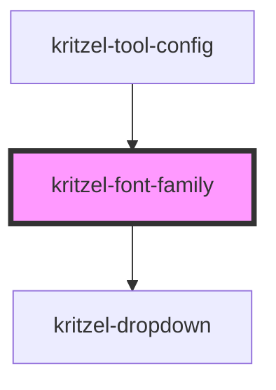

# kritzel-font-family

<!-- Auto Generated Below -->

## Properties

| Property             | Attribute              | Description | Type           | Default     |
| -------------------- | ---------------------- | ----------- | -------------- | ----------- |
| `fontOptions`        | --                     |             | `FontOption[]` | `[]`        |
| `selectedFontFamily` | `selected-font-family` |             | `string`       | `undefined` |

## Events

| Event              | Description | Type                  |
| ------------------ | ----------- | --------------------- |
| `fontFamilyChange` |             | `CustomEvent<string>` |

## Dependencies

### Used by

 - [kritzel-tool-config](../kritzel-tool-config)

### Depends on

- [kritzel-dropdown](../kritzel-dropdown)

### Graph

----------------------------------------------

*Built with [StencilJS](https://stenciljs.com/)*
