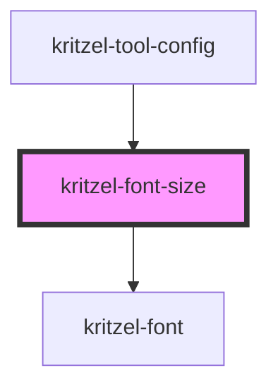

# kritzel-font-size

<!-- Auto Generated Below -->

## Properties

| Property       | Attribute       | Description | Type       | Default                   |
| -------------- | --------------- | ----------- | ---------- | ------------------------- |
| `fontFamily`   | `font-family`   |             | `string`   | `'Arial'`                 |
| `selectedSize` | `selected-size` |             | `number`   | `null`                    |
| `sizes`        | --              |             | `number[]` | `[8, 10, 12, 16, 20, 24]` |

## Events

| Event        | Description | Type                  |
| ------------ | ----------- | --------------------- |
| `sizeChange` |             | `CustomEvent<number>` |

## Dependencies

### Used by

 - [kritzel-tool-config](../kritzel-tool-config)

### Depends on

- [kritzel-font](../kritzel-font)

### Graph

----------------------------------------------

*Built with [StencilJS](https://stenciljs.com/)*
