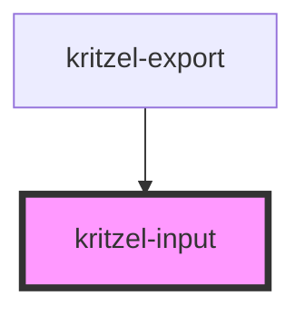

# kritzel-input

A text input component with optional label and suffix support.

## Usage

```html
<kritzel-input
  label="Filename"
  value="my-file"
  placeholder="Enter filename"
  suffix=".json"
></kritzel-input>
```

<!-- Auto Generated Below -->


## Properties

| Property      | Attribute     | Description                                                  | Type                                       | Default  |
| ------------- | ------------- | ------------------------------------------------------------ | ------------------------------------------ | -------- |
| `disabled`    | `disabled`    | Whether the input is disabled                                | `boolean`                                  | `false`  |
| `label`       | `label`       | Label text displayed above the input                         | `string`                                   | `''`     |
| `placeholder` | `placeholder` | Placeholder text shown when input is empty                   | `string`                                   | `''`     |
| `suffix`      | `suffix`      | Suffix text displayed after the input (e.g., file extension) | `string`                                   | `''`     |
| `type`        | `type`        | Input type                                                   | `"email" \| "password" \| "text" \| "url"` | `'text'` |
| `value`       | `value`       | Current text value                                           | `string`                                   | `''`     |


## Events

| Event         | Description                    | Type                  |
| ------------- | ------------------------------ | --------------------- |
| `valueChange` | Emitted when the value changes | `CustomEvent<string>` |


## Dependencies

### Used by

 - [kritzel-export](../kritzel-export)

### Graph


----------------------------------------------

*Built with [StencilJS](https://stenciljs.com/)*
