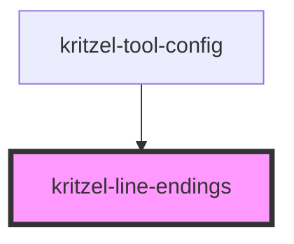

# kritzel-line-endings

A component for selecting line ending styles (arrows) for both the start and end of a line.

<!-- Auto Generated Below -->

## Properties

| Property | Attribute | Description                      | Type               | Default                |
| -------- | --------- | -------------------------------- | ------------------ | ---------------------- |
| `styles` | --        | Available ending styles          | `LineEndingType[]` | `['none', 'triangle']` |
| `value`  | --        | Current line arrow configuration | `LineArrowConfig`  | `undefined`            |

## Events

| Event         | Description | Type                           |
| ------------- | ----------- | ------------------------------ |
| `valueChange` |             | `CustomEvent<LineArrowConfig>` |

## Dependencies

### Used by

 - [kritzel-tool-config](../kritzel-tool-config)

### Graph

----------------------------------------------

*Built with [StencilJS](https://stenciljs.com/)*
