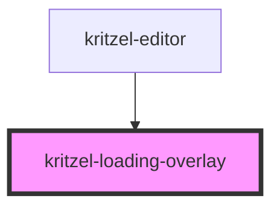

# kritzel-loading-overlay

<!-- Auto Generated Below -->

## Properties

| Property  | Attribute | Description                             | Type      | Default        |
| --------- | --------- | --------------------------------------- | --------- | -------------- |
| `text`    | `text`    | The text to display next to the spinner | `string`  | `'Loading...'` |
| `visible` | `visible` | Whether the overlay is visible          | `boolean` | `false`        |

## Dependencies

### Used by

 - [kritzel-editor](../kritzel-editor)

### Graph

----------------------------------------------

*Built with [StencilJS](https://stenciljs.com/)*
