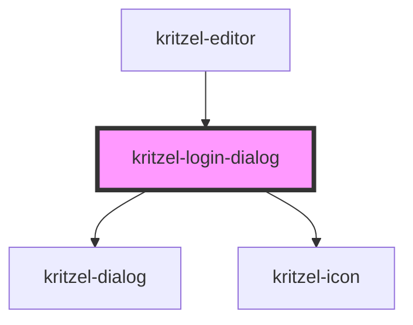

# kritzel-login-dialog

<!-- Auto Generated Below -->

## Overview

Login dialog component for displaying authentication provider buttons.
This is a presentational component that emits events for all actions.
The parent component (kritzel-editor) handles the actual authentication flow.

## Properties

| Property      | Attribute      | Description                                        | Type                     | Default     |
| ------------- | -------------- | -------------------------------------------------- | ------------------------ | ----------- |
| `dialogTitle` | `dialog-title` | Dialog title                                       | `string`                 | `'Sign in'` |
| `providers`   | --             | Array of authentication provider buttons to render | `KritzelLoginProvider[]` | `[]`        |
| `subtitle`    | `subtitle`     | Optional subtitle text displayed below the title   | `string`                 | `undefined` |

## Events

| Event           | Description                               | Type                      |
| --------------- | ----------------------------------------- | ------------------------- |
| `dialogClosed`  | Emitted when the dialog is closed         | `CustomEvent<void>`       |
| `providerLogin` | Emitted when a provider button is clicked | `CustomEvent<LoginEvent>` |

## Methods

### `close() => Promise<void>`

Closes the login dialog

#### Returns

Type: `Promise<void>`

### `open() => Promise<void>`

Opens the login dialog

#### Returns

Type: `Promise<void>`

### `setLoading(provider: string | null) => Promise<void>`

Sets or clears the loading state on a provider button

#### Parameters

| Name       | Type     | Description |
| ---------- | -------- | ----------- |
| `provider` | `string` |             |

#### Returns

Type: `Promise<void>`

## Dependencies

### Used by

 - [kritzel-editor](../kritzel-editor)

### Depends on

- [kritzel-dialog](../kritzel-dialog)
- kritzel-icon

### Graph

----------------------------------------------

*Built with [StencilJS](https://stenciljs.com/)*
