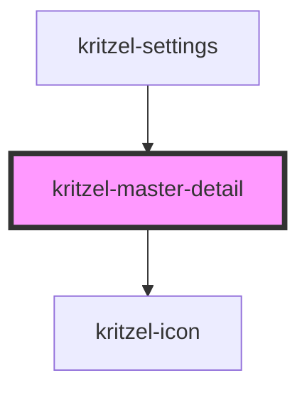

# kritzel-master-detail

<!-- Auto Generated Below -->

## Properties

| Property         | Attribute          | Description                                               | Type                         | Default     |
| ---------------- | ------------------ | --------------------------------------------------------- | ---------------------------- | ----------- |
| `items`          | --                 | Array of menu items to display in the master (left) panel | `IKritzelMasterDetailItem[]` | `[]`        |
| `selectedItemId` | `selected-item-id` | ID of the currently selected item                         | `string`                     | `undefined` |

## Events

| Event        | Description                      | Type                                           |
| ------------ | -------------------------------- | ---------------------------------------------- |
| `itemSelect` | Emitted when an item is selected | `CustomEvent<IKritzelMasterDetailSelectEvent>` |

## Slots

| Slot | Description      |
| ---- | ---------------- |
|      | The default slot |

## Dependencies

### Used by

 - [kritzel-settings](../kritzel-settings)

### Depends on

- kritzel-icon

### Graph

----------------------------------------------

*Built with [StencilJS](https://stenciljs.com/)*
