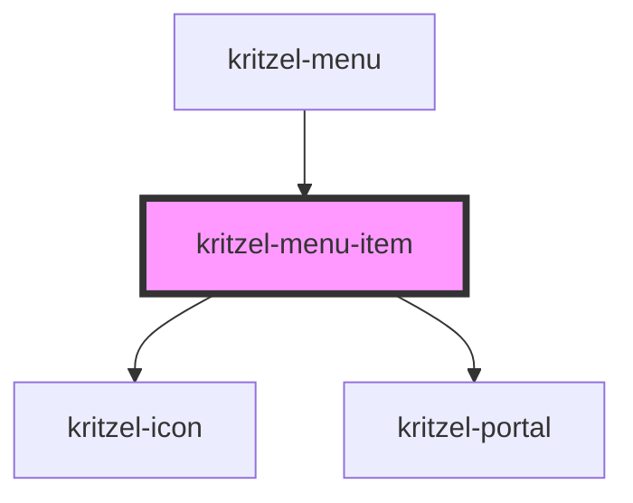

# kritzel-menu-item

<!-- Auto Generated Below -->

## Properties

| Property | Attribute | Description | Type                    | Default     |
| -------- | --------- | ----------- | ----------------------- | ----------- |
| `item`   | --        |             | `IKritzelMenuItem<any>` | `undefined` |
| `parent` | --        |             | `IKritzelMenuItem<any>` | `null`      |

## Events

| Event                 | Description | Type                                                |
| --------------------- | ----------- | --------------------------------------------------- |
| `itemCancel`          |             | `CustomEvent<IKritzelMenuItem<any>>`                |
| `itemCloseChildMenu`  |             | `CustomEvent<IKritzelMenuItem<any>>`                |
| `itemSave`            |             | `CustomEvent<IKritzelMenuItem<any>>`                |
| `itemSelect`          |             | `CustomEvent<IKritzelMenuItemSelectEvent>`          |
| `itemToggleChildMenu` |             | `CustomEvent<IKritzelMenuItemToggleChildMenuEvent>` |

## Dependencies

### Used by

 - [kritzel-menu](../kritzel-menu)

### Depends on

- kritzel-icon
- [kritzel-portal](../kritzel-portal)

### Graph

----------------------------------------------

*Built with [StencilJS](https://stenciljs.com/)*
