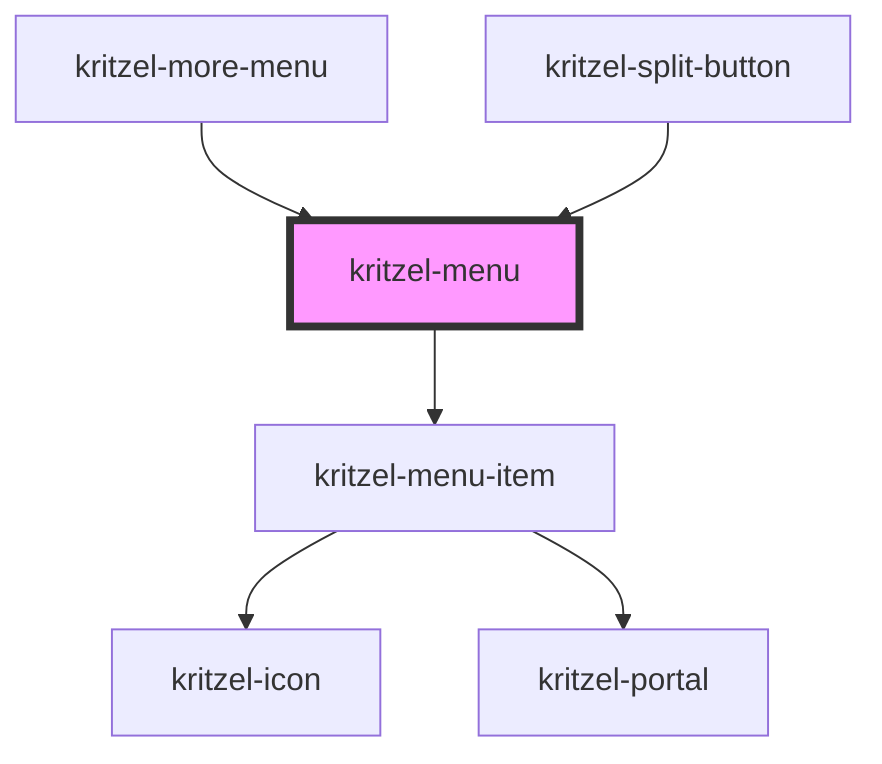

# kritzel-menu

<!-- Auto Generated Below -->

## Properties

| Property | Attribute | Description | Type                      | Default     |
| -------- | --------- | ----------- | ------------------------- | ----------- |
| `items`  | --        |             | `IKritzelMenuItem<any>[]` | `undefined` |
| `parent` | --        |             | `IKritzelMenuItem<any>`   | `null`      |

## Events

| Event                 | Description | Type                                                |
| --------------------- | ----------- | --------------------------------------------------- |
| `close`               |             | `CustomEvent<void>`                                 |
| `itemCancel`          |             | `CustomEvent<IKritzelMenuItem<any>>`                |
| `itemCloseChildMenu`  |             | `CustomEvent<IKritzelMenuItem<any>>`                |
| `itemSave`            |             | `CustomEvent<IKritzelMenuItem<any>>`                |
| `itemSelect`          |             | `CustomEvent<IKritzelMenuItemSelectEvent>`          |
| `itemToggleChildMenu` |             | `CustomEvent<IKritzelMenuItemToggleChildMenuEvent>` |

## Methods

### `setFocus() => Promise<void>`

#### Returns

Type: `Promise<void>`

### `setScrollTop(scrollTop: number) => Promise<void>`

#### Parameters

| Name        | Type     | Description |
| ----------- | -------- | ----------- |
| `scrollTop` | `number` |             |

#### Returns

Type: `Promise<void>`

## Dependencies

### Used by

 - [kritzel-more-menu](../kritzel-more-menu)
 - [kritzel-split-button](../kritzel-split-button)

### Depends on

- [kritzel-menu-item](../kritzel-menu-item)

### Graph

----------------------------------------------

*Built with [StencilJS](https://stenciljs.com/)*
