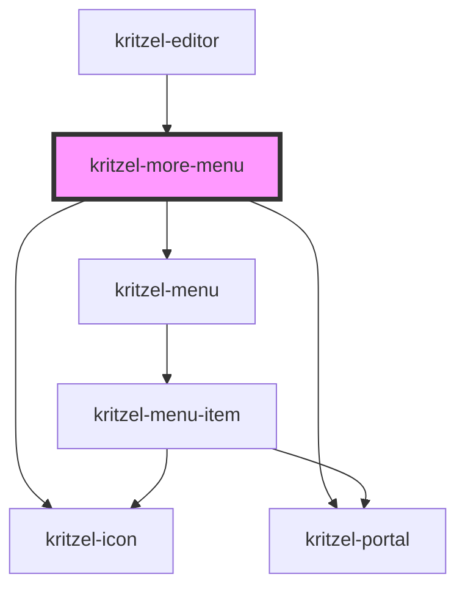

# kritzel-more-menu

A button component that displays a dropdown menu when clicked. Commonly used for "more options" or ellipsis menus.

## Usage

```html
<kritzel-more-menu items={menuItems}></kritzel-more-menu>
```

## Properties

| Property   | Type                 | Default              | Description                              |
| ---------- | -------------------- | -------------------- | ---------------------------------------- |
| `items`    | `IKritzelMenuItem[]` | `[]`                 | The menu items to display in the dropdown |
| `icon`     | `string`             | `'ellipsisVertical'`| The icon to display on the button        |
| `iconSize` | `number`             | `24`                 | The size of the icon                     |
| `offsetY`  | `number`             | `4`                  | Offset Y for the portal positioning      |

## Events

| Event        | Detail                                            | Description                        |
| ------------ | ------------------------------------------------- | ---------------------------------- |
| `itemSelect` | `{ item: IKritzelMenuItem; parent: IKritzelMenuItem }` | Emitted when a menu item is selected |

## CSS Custom Properties

| Property                                        | Default                      | Description                            |
| ----------------------------------------------- | ---------------------------- | -------------------------------------- |
| `--kritzel-more-menu-button-width`              | `50px`                       | Button width                           |
| `--kritzel-more-menu-button-height`             | `50px`                       | Button height                          |
| `--kritzel-more-menu-button-border`             | `1px solid #ebebeb`          | Button border                          |
| `--kritzel-more-menu-button-border-radius`      | `12px`                       | Button border radius                   |
| `--kritzel-more-menu-button-background-color`   | `#ffffff`                    | Button background color                |
| `--kritzel-more-menu-button-box-shadow`         | `0 0 3px rgba(0, 0, 0, 0.08)`| Button box shadow                      |
| `--kritzel-more-menu-button-hover-background-color`  | `#f5f5f5`               | Button hover background color          |
| `--kritzel-more-menu-button-active-background-color` | `#ebebeb`               | Button active background color         |

<!-- Auto Generated Below -->


## Properties

| Property   | Attribute   | Description                                                                                                                                                               | Type                                                                                                                                                                                                                                                                                                                                                                                                                                                                                                                                                                                                                                                                                                                                                                                                                                                                                                                                                                                                                                                                                                                                                                                                                                                                                                                                                                                                                                                                                                                                                                                                                                                                                                                                                                                                                                                                                                                                                                                                                                                                                                                                                                                                                                                                                                                                                                                                                                                                                                                                                                                                                                                                                                                                                                                                                                                                                                                                                                                     | Default              |
| ---------- | ----------- | ------------------------------------------------------------------------------------------------------------------------------------------------------------------------- | ---------------------------------------------------------------------------------------------------------------------------------------------------------------------------------------------------------------------------------------------------------------------------------------------------------------------------------------------------------------------------------------------------------------------------------------------------------------------------------------------------------------------------------------------------------------------------------------------------------------------------------------------------------------------------------------------------------------------------------------------------------------------------------------------------------------------------------------------------------------------------------------------------------------------------------------------------------------------------------------------------------------------------------------------------------------------------------------------------------------------------------------------------------------------------------------------------------------------------------------------------------------------------------------------------------------------------------------------------------------------------------------------------------------------------------------------------------------------------------------------------------------------------------------------------------------------------------------------------------------------------------------------------------------------------------------------------------------------------------------------------------------------------------------------------------------------------------------------------------------------------------------------------------------------------------------------------------------------------------------------------------------------------------------------------------------------------------------------------------------------------------------------------------------------------------------------------------------------------------------------------------------------------------------------------------------------------------------------------------------------------------------------------------------------------------------------------------------------------------------------------------------------------------------------------------------------------------------------------------------------------------------------------------------------------------------------------------------------------------------------------------------------------------------------------------------------------------------------------------------------------------------------------------------------------------------------------------------------------------------- | -------------------- |
| `icon`     | `icon`      | The icon to display on the button                                                                                                                                         | `string`                                                                                                                                                                                                                                                                                                                                                                                                                                                                                                                                                                                                                                                                                                                                                                                                                                                                                                                                                                                                                                                                                                                                                                                                                                                                                                                                                                                                                                                                                                                                                                                                                                                                                                                                                                                                                                                                                                                                                                                                                                                                                                                                                                                                                                                                                                                                                                                                                                                                                                                                                                                                                                                                                                                                                                                                                                                                                                                                                                                 | `'ellipsisVertical'` |
| `iconSize` | `icon-size` | The size of the icon                                                                                                                                                      | `number`                                                                                                                                                                                                                                                                                                                                                                                                                                                                                                                                                                                                                                                                                                                                                                                                                                                                                                                                                                                                                                                                                                                                                                                                                                                                                                                                                                                                                                                                                                                                                                                                                                                                                                                                                                                                                                                                                                                                                                                                                                                                                                                                                                                                                                                                                                                                                                                                                                                                                                                                                                                                                                                                                                                                                                                                                                                                                                                                                                                 | `24`                 |
| `items`    | --          | The menu items to display in the dropdown. Items with `isVisible` set to `false` will be filtered out. Items with an `action` will have that action invoked on selection. | `IKritzelMenuItem<any>[]`                                                                                                                                                                                                                                                                                                                                                                                                                                                                                                                                                                                                                                                                                                                                                                                                                                                                                                                                                                                                                                                                                                                                                                                                                                                                                                                                                                                                                                                                                                                                                                                                                                                                                                                                                                                                                                                                                                                                                                                                                                                                                                                                                                                                                                                                                                                                                                                                                                                                                                                                                                                                                                                                                                                                                                                                                                                                                                                                                                | `[]`                 |
| `offsetY`  | `offset-y`  | Offset Y for the portal positioning                                                                                                                                       | `number`                                                                                                                                                                                                                                                                                                                                                                                                                                                                                                                                                                                                                                                                                                                                                                                                                                                                                                                                                                                                                                                                                                                                                                                                                                                                                                                                                                                                                                                                                                                                                                                                                                                                                                                                                                                                                                                                                                                                                                                                                                                                                                                                                                                                                                                                                                                                                                                                                                                                                                                                                                                                                                                                                                                                                                                                                                                                                                                                                                                 | `4`                  |
| `terms`    | --          | Resolved localized strings keyed by term key, supplied by the editor.                                                                                                     | `"backToContent.label" \| "currentUser.dialogTitle" \| "editor.loading" \| "export.dialogTitle" \| "export.exportButton" \| "export.filename.label" \| "export.filename.placeholder" \| "export.format.label" \| "export.tabs.viewport" \| "export.tabs.workspace" \| "login.dialogTitle" \| "menu.align" \| "menu.alignBottom" \| "menu.alignCenterHorizontal" \| "menu.alignCenterVertical" \| "menu.alignLeft" \| "menu.alignRight" \| "menu.alignTop" \| "menu.bringToFront" \| "menu.copy" \| "menu.cut" \| "menu.delete" \| "menu.export" \| "menu.exportAsPng" \| "menu.exportAsSvg" \| "menu.group" \| "menu.import" \| "menu.logout" \| "menu.moveDown" \| "menu.moveUp" \| "menu.order" \| "menu.paste" \| "menu.selectAll" \| "menu.sendToBack" \| "menu.settings" \| "menu.share" \| "menu.ungroup" \| "moreMenu.ariaLabel" \| "settings.about.description" \| "settings.about.title" \| "settings.categories.about" \| "settings.categories.developer" \| "settings.categories.general" \| "settings.categories.shortcuts" \| "settings.categories.viewport" \| "settings.developer.showMigrationInfo.description" \| "settings.developer.showMigrationInfo.label" \| "settings.developer.showObjectInfo.description" \| "settings.developer.showObjectInfo.label" \| "settings.developer.showSyncProviderInfo.description" \| "settings.developer.showSyncProviderInfo.label" \| "settings.developer.showViewportInfo.description" \| "settings.developer.showViewportInfo.label" \| "settings.developer.title" \| "settings.dialogTitle" \| "settings.general.language.description" \| "settings.general.language.label" \| "settings.general.lockDrawingScale.description" \| "settings.general.lockDrawingScale.label" \| "settings.general.theme.description" \| "settings.general.theme.label" \| "settings.general.title" \| "settings.shortcuts.title" \| "settings.viewport.boundaryBottom.description" \| "settings.viewport.boundaryBottom.label" \| "settings.viewport.boundaryLeft.description" \| "settings.viewport.boundaryLeft.label" \| "settings.viewport.boundaryPlaceholder" \| "settings.viewport.boundaryRight.description" \| "settings.viewport.boundaryRight.label" \| "settings.viewport.boundaryTop.description" \| "settings.viewport.boundaryTop.label" \| "settings.viewport.maxZoom.description" \| "settings.viewport.maxZoom.label" \| "settings.viewport.minZoom.description" \| "settings.viewport.minZoom.label" \| "settings.viewport.title" \| "share.copyLink.copied" \| "share.copyLink.title" \| "share.dialogTitle" \| "share.linkSharing.disabledDescription" \| "share.linkSharing.enabledDescription" \| "share.linkSharing.label" \| "share.linkSharing.toggleLabel" \| "toolConfig.collapse" \| "toolConfig.expand" \| "utility.delete" \| "utility.redo" \| "utility.undo" \| "watermark.poweredBy" \| "workspace.delete" \| "workspace.rename" \| "workspace.sharedTooltip" \| "zoom.zoomIn" \| "zoom.zoomOut" \| string` | `{}`                 |
| `visible`  | `visible`   | Whether the menu button is visible                                                                                                                                        | `boolean`                                                                                                                                                                                                                                                                                                                                                                                                                                                                                                                                                                                                                                                                                                                                                                                                                                                                                                                                                                                                                                                                                                                                                                                                                                                                                                                                                                                                                                                                                                                                                                                                                                                                                                                                                                                                                                                                                                                                                                                                                                                                                                                                                                                                                                                                                                                                                                                                                                                                                                                                                                                                                                                                                                                                                                                                                                                                                                                                                                                | `false`              |


## Events

| Event        | Description                          | Type                                                                           |
| ------------ | ------------------------------------ | ------------------------------------------------------------------------------ |
| `itemSelect` | Emitted when a menu item is selected | `CustomEvent<{ item: IKritzelMenuItem<any>; parent: IKritzelMenuItem<any>; }>` |


## Methods

### `close() => Promise<void>`


#### Returns

Type: `Promise<void>`


### `open() => Promise<void>`


#### Returns

Type: `Promise<void>`


## Dependencies

### Used by

 - [kritzel-editor](../kritzel-editor)

### Depends on

- kritzel-icon
- [kritzel-portal](../kritzel-portal)
- [kritzel-menu](../kritzel-menu)

### Graph


----------------------------------------------

*Built with [StencilJS](https://stenciljs.com/)*
