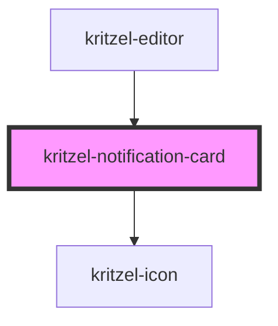

# kritzel-notification-card

A lightweight card component for rendering a `KritzelNotification` object.

## Usage

```html
<kritzel-notification-card
  notification={notification}
  showTimestamp={true}
  locale="en"
></kritzel-notification-card>
```

```ts
const notification = {
  id: 'n-1',
  type: 'warning',
  message: 'Connection is unstable. Changes may sync with delay.',
  timestamp: new Date(),
};
```

## CSS Variables

| Variable | Default | Description |
|----------|---------|-------------|
| `--kritzel-notification-card-max-width` | `360px` | Maximum card width |
| `--kritzel-notification-card-padding` | `12px 14px` | Card padding |
| `--kritzel-notification-card-border` | `1px solid #e5e7eb` | Card border |
| `--kritzel-notification-card-border-left-width` | `4px` | Accent border width |
| `--kritzel-notification-card-border-radius` | `12px` | Card border radius |
| `--kritzel-notification-card-background-color` | `#ffffff` | Card background color |
| `--kritzel-notification-card-color` | `#111827` | Card text color |
| `--kritzel-notification-card-box-shadow` | `0 8px 20px rgba(15, 23, 42, 0.08)` | Card shadow |
| `--kritzel-notification-card-info-accent-color` | `#1d4ed8` | Accent color for info notifications |
| `--kritzel-notification-card-warning-accent-color` | `#b45309` | Accent color for warning notifications |
| `--kritzel-notification-card-error-accent-color` | `#b91c1c` | Accent color for error notifications |
| `--kritzel-notification-card-header-gap` | `8px` | Gap between badge and timestamp |
| `--kritzel-notification-card-header-margin-bottom` | `8px` | Header spacing below |
| `--kritzel-notification-card-pill-height` | `22px` | Badge height |
| `--kritzel-notification-card-pill-padding` | `0 8px` | Badge horizontal padding |
| `--kritzel-notification-card-pill-border-radius` | `999px` | Badge border radius |
| `--kritzel-notification-card-pill-background-color` | `#f3f4f6` | Badge background |
| `--kritzel-notification-card-pill-color` | `#111827` | Badge text color |
| `--kritzel-notification-card-pill-font-size` | `12px` | Badge font size |
| `--kritzel-notification-card-pill-font-weight` | `600` | Badge font weight |
| `--kritzel-notification-card-timestamp-color` | `#6b7280` | Timestamp color |
| `--kritzel-notification-card-timestamp-font-size` | `12px` | Timestamp font size |
| `--kritzel-notification-card-message-color` | `inherit` | Message text color |
| `--kritzel-notification-card-message-font-size` | `14px` | Message font size |
| `--kritzel-notification-card-message-line-height` | `1.45` | Message line height |

<!-- Auto Generated Below -->


## Properties

| Property        | Attribute        | Description                                                       | Type                  | Default     |
| --------------- | ---------------- | ----------------------------------------------------------------- | --------------------- | ----------- |
| `locale`        | `locale`         | Locale used for formatting the timestamp.                         | `string`              | `undefined` |
| `notification`  | --               | Notification data rendered by this card.                          | `KritzelNotification` | `undefined` |
| `showTimestamp` | `show-timestamp` | Whether a formatted timestamp should be displayed when available. | `boolean`             | `true`      |


## Events

| Event         | Description                                                 | Type                   |
| ------------- | ----------------------------------------------------------- | ---------------------- |
| `dismiss`     | Emitted when the notification should be dismissed manually. | `CustomEvent<void>`    |
| `hoverChange` | Emitted when pointer hover state changes.                   | `CustomEvent<boolean>` |


## Dependencies

### Used by

 - [kritzel-editor](../kritzel-editor)

### Depends on

- kritzel-icon

### Graph


----------------------------------------------

*Built with [StencilJS](https://stenciljs.com/)*
