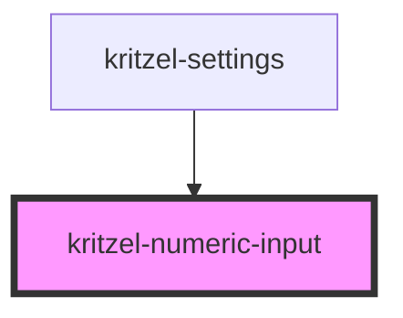

# kritzel-numeric-input

<!-- Auto Generated Below -->

## Properties

| Property      | Attribute     | Description                                    | Type     | Default                   |
| ------------- | ------------- | ---------------------------------------------- | -------- | ------------------------- |
| `label`       | `label`       | Label text displayed above the input           | `string` | `''`                      |
| `max`         | `max`         | Maximum allowed value                          | `number` | `Number.MAX_SAFE_INTEGER` |
| `min`         | `min`         | Minimum allowed value                          | `number` | `Number.MIN_SAFE_INTEGER` |
| `placeholder` | `placeholder` | Placeholder text shown when input is empty     | `string` | `''`                      |
| `step`        | `step`        | Step increment for the input                   | `number` | `1`                       |
| `value`       | `value`       | Current numeric value (undefined when cleared) | `number` | `undefined`               |

## Events

| Event         | Description                                          | Type                  |
| ------------- | ---------------------------------------------------- | --------------------- |
| `valueChange` | Emitted when the value changes (after normalization) | `CustomEvent<number>` |

## Dependencies

### Used by

 - [kritzel-settings](../kritzel-settings)

### Graph

----------------------------------------------

*Built with [StencilJS](https://stenciljs.com/)*
