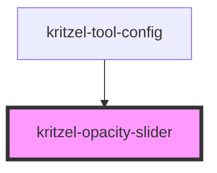

# kritzel-opacity-slider

A range slider component for adjusting opacity values. Displays a preview swatch with the current opacity applied, along with a percentage indicator.

<!-- Auto Generated Below -->

## Properties

| Property       | Attribute       | Description                                | Type     | Default     |
| -------------- | --------------- | ------------------------------------------ | -------- | ----------- |
| `max`          | `max`           | Maximum opacity value                      | `number` | `1`         |
| `min`          | `min`           | Minimum opacity value                      | `number` | `0`         |
| `previewColor` | `preview-color` | Color to display in the preview (optional) | `string` | `'#000000'` |
| `step`         | `step`          | Step increment                             | `number` | `0.01`      |
| `value`        | `value`         | Current opacity value (0 to 1)             | `number` | `1`         |

## Events

| Event         | Description | Type                  |
| ------------- | ----------- | --------------------- |
| `valueChange` |             | `CustomEvent<number>` |

## Dependencies

### Used by

 - [kritzel-tool-config](../kritzel-tool-config)

### Graph

----------------------------------------------

*Built with [StencilJS](https://stenciljs.com/)*
