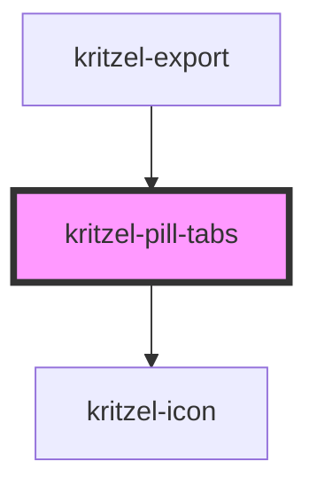

# kritzel-pill-tabs

<!-- Auto Generated Below -->

## Properties

| Property | Attribute | Description                        | Type               | Default     |
| -------- | --------- | ---------------------------------- | ------------------ | ----------- |
| `tabs`   | --        | Array of tab definitions to render | `KritzelPillTab[]` | `[]`        |
| `value`  | `value`   | Currently selected tab ID          | `string`           | `undefined` |

## Events

| Event         | Description                           | Type                  |
| ------------- | ------------------------------------- | --------------------- |
| `valueChange` | Emitted when the selected tab changes | `CustomEvent<string>` |

## Dependencies

### Used by

 - [kritzel-export](../kritzel-export)

### Depends on

- kritzel-icon

### Graph

----------------------------------------------

*Built with [StencilJS](https://stenciljs.com/)*
