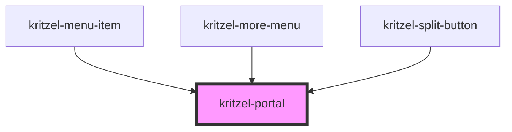

# kritzel-portal

<!-- Auto Generated Below -->

## Properties

| Property    | Attribute    | Description | Type          | Default     |
| ----------- | ------------ | ----------- | ------------- | ----------- |
| `anchor`    | --           |             | `HTMLElement` | `undefined` |
| `autoFocus` | `auto-focus` |             | `boolean`     | `true`      |
| `offsetX`   | `offset-x`   |             | `number`      | `undefined` |
| `offsetY`   | `offset-y`   |             | `number`      | `undefined` |

## Events

| Event   | Description | Type                |
| ------- | ----------- | ------------------- |
| `close` |             | `CustomEvent<void>` |

## Slots

| Slot | Description      |
| ---- | ---------------- |
|      | The default slot |

## Dependencies

### Used by

 - [kritzel-menu-item](../kritzel-menu-item)
 - [kritzel-more-menu](../kritzel-more-menu)
 - [kritzel-split-button](../kritzel-split-button)

### Graph

----------------------------------------------

*Built with [StencilJS](https://stenciljs.com/)*
