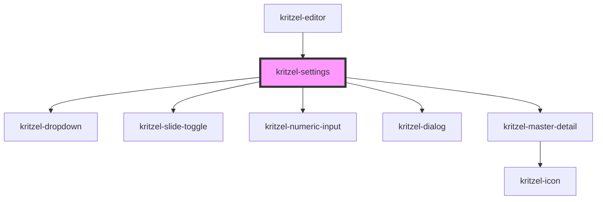

# kritzel-settings

A settings button component that opens a settings dialog when clicked.

## Usage

```html
<kritzel-settings></kritzel-settings>
```

## CSS Custom Properties

### Button Styling

| Property                                          | Default                      | Description                            |
| ------------------------------------------------- | ---------------------------- | -------------------------------------- |
| `--kritzel-settings-button-width`                 | `50px`                       | Button width                           |
| `--kritzel-settings-button-height`                | `50px`                       | Button height                          |
| `--kritzel-settings-button-border`                | `1px solid #ebebeb`          | Button border                          |
| `--kritzel-settings-button-border-radius`         | `12px`                       | Button border radius                   |
| `--kritzel-settings-button-background-color`      | `#ffffff`                    | Button background color                |
| `--kritzel-settings-button-box-shadow`            | `0 0 3px rgba(0, 0, 0, 0.08)`| Button box shadow                      |
| `--kritzel-settings-button-hover-background-color`| `#f5f5f5`                    | Button hover background color          |
| `--kritzel-settings-button-active-background-color`| `#ebebeb`                   | Button active background color         |

<!-- Auto Generated Below -->


## Properties

| Property           | Attribute | Description                                                                          | Type                                                                                                                                                                                                                                                                                                                                                                                                                                                                                                                                                                                                                                                                                                                                                                                                                                                                                                                                                                                                                                                                                                                                                                                                                                                                                                                                                                                                                                                                                                                                                                                                                                                                                                                                                                                                                                                                                                                                                                                                                                                                                                                                                                                                                                                                                                                                                                                                                                                                                                                                                                                                                                                                                                                                                                                                                                                                                                                                                                                     | Default             |
| ------------------ | --------- | ------------------------------------------------------------------------------------ | ---------------------------------------------------------------------------------------------------------------------------------------------------------------------------------------------------------------------------------------------------------------------------------------------------------------------------------------------------------------------------------------------------------------------------------------------------------------------------------------------------------------------------------------------------------------------------------------------------------------------------------------------------------------------------------------------------------------------------------------------------------------------------------------------------------------------------------------------------------------------------------------------------------------------------------------------------------------------------------------------------------------------------------------------------------------------------------------------------------------------------------------------------------------------------------------------------------------------------------------------------------------------------------------------------------------------------------------------------------------------------------------------------------------------------------------------------------------------------------------------------------------------------------------------------------------------------------------------------------------------------------------------------------------------------------------------------------------------------------------------------------------------------------------------------------------------------------------------------------------------------------------------------------------------------------------------------------------------------------------------------------------------------------------------------------------------------------------------------------------------------------------------------------------------------------------------------------------------------------------------------------------------------------------------------------------------------------------------------------------------------------------------------------------------------------------------------------------------------------------------------------------------------------------------------------------------------------------------------------------------------------------------------------------------------------------------------------------------------------------------------------------------------------------------------------------------------------------------------------------------------------------------------------------------------------------------------------------------------------------- | ------------------- |
| `availableLocales` | --        | Available locales as `{ code, label }` options for the language selector.            | `{ code: LocaleCode; label: string; }[]`                                                                                                                                                                                                                                                                                                                                                                                                                                                                                                                                                                                                                                                                                                                                                                                                                                                                                                                                                                                                                                                                                                                                                                                                                                                                                                                                                                                                                                                                                                                                                                                                                                                                                                                                                                                                                                                                                                                                                                                                                                                                                                                                                                                                                                                                                                                                                                                                                                                                                                                                                                                                                                                                                                                                                                                                                                                                                                                                                 | `[]`                |
| `availableThemes`  | --        | Keyboard shortcuts to display in the settings dialog                                 | `string[]`                                                                                                                                                                                                                                                                                                                                                                                                                                                                                                                                                                                                                                                                                                                                                                                                                                                                                                                                                                                                                                                                                                                                                                                                                                                                                                                                                                                                                                                                                                                                                                                                                                                                                                                                                                                                                                                                                                                                                                                                                                                                                                                                                                                                                                                                                                                                                                                                                                                                                                                                                                                                                                                                                                                                                                                                                                                                                                                                                                               | `['light', 'dark']` |
| `settings`         | --        | Current settings values. Used to initialize and sync the component's internal state. | `KritzelSettingsConfig`                                                                                                                                                                                                                                                                                                                                                                                                                                                                                                                                                                                                                                                                                                                                                                                                                                                                                                                                                                                                                                                                                                                                                                                                                                                                                                                                                                                                                                                                                                                                                                                                                                                                                                                                                                                                                                                                                                                                                                                                                                                                                                                                                                                                                                                                                                                                                                                                                                                                                                                                                                                                                                                                                                                                                                                                                                                                                                                                                                  | `undefined`         |
| `shortcuts`        | --        |                                                                                      | `Omit<KritzelShortcut, "action" \| "condition">[]`                                                                                                                                                                                                                                                                                                                                                                                                                                                                                                                                                                                                                                                                                                                                                                                                                                                                                                                                                                                                                                                                                                                                                                                                                                                                                                                                                                                                                                                                                                                                                                                                                                                                                                                                                                                                                                                                                                                                                                                                                                                                                                                                                                                                                                                                                                                                                                                                                                                                                                                                                                                                                                                                                                                                                                                                                                                                                                                                       | `[]`                |
| `terms`            | --        | Resolved localized strings keyed by term key, supplied by the editor.                | `"backToContent.label" \| "currentUser.dialogTitle" \| "editor.loading" \| "export.dialogTitle" \| "export.exportButton" \| "export.filename.label" \| "export.filename.placeholder" \| "export.format.label" \| "export.tabs.viewport" \| "export.tabs.workspace" \| "login.dialogTitle" \| "menu.align" \| "menu.alignBottom" \| "menu.alignCenterHorizontal" \| "menu.alignCenterVertical" \| "menu.alignLeft" \| "menu.alignRight" \| "menu.alignTop" \| "menu.bringToFront" \| "menu.copy" \| "menu.cut" \| "menu.delete" \| "menu.export" \| "menu.exportAsPng" \| "menu.exportAsSvg" \| "menu.group" \| "menu.import" \| "menu.logout" \| "menu.moveDown" \| "menu.moveUp" \| "menu.order" \| "menu.paste" \| "menu.selectAll" \| "menu.sendToBack" \| "menu.settings" \| "menu.share" \| "menu.ungroup" \| "moreMenu.ariaLabel" \| "settings.about.description" \| "settings.about.title" \| "settings.categories.about" \| "settings.categories.developer" \| "settings.categories.general" \| "settings.categories.shortcuts" \| "settings.categories.viewport" \| "settings.developer.showMigrationInfo.description" \| "settings.developer.showMigrationInfo.label" \| "settings.developer.showObjectInfo.description" \| "settings.developer.showObjectInfo.label" \| "settings.developer.showSyncProviderInfo.description" \| "settings.developer.showSyncProviderInfo.label" \| "settings.developer.showViewportInfo.description" \| "settings.developer.showViewportInfo.label" \| "settings.developer.title" \| "settings.dialogTitle" \| "settings.general.language.description" \| "settings.general.language.label" \| "settings.general.lockDrawingScale.description" \| "settings.general.lockDrawingScale.label" \| "settings.general.theme.description" \| "settings.general.theme.label" \| "settings.general.title" \| "settings.shortcuts.title" \| "settings.viewport.boundaryBottom.description" \| "settings.viewport.boundaryBottom.label" \| "settings.viewport.boundaryLeft.description" \| "settings.viewport.boundaryLeft.label" \| "settings.viewport.boundaryPlaceholder" \| "settings.viewport.boundaryRight.description" \| "settings.viewport.boundaryRight.label" \| "settings.viewport.boundaryTop.description" \| "settings.viewport.boundaryTop.label" \| "settings.viewport.maxZoom.description" \| "settings.viewport.maxZoom.label" \| "settings.viewport.minZoom.description" \| "settings.viewport.minZoom.label" \| "settings.viewport.title" \| "share.copyLink.copied" \| "share.copyLink.title" \| "share.dialogTitle" \| "share.linkSharing.disabledDescription" \| "share.linkSharing.enabledDescription" \| "share.linkSharing.label" \| "share.linkSharing.toggleLabel" \| "toolConfig.collapse" \| "toolConfig.expand" \| "utility.delete" \| "utility.redo" \| "utility.undo" \| "watermark.poweredBy" \| "workspace.delete" \| "workspace.rename" \| "workspace.sharedTooltip" \| "zoom.zoomIn" \| "zoom.zoomOut" \| string` | `{}`                |


## Events

| Event            | Description                  | Type                                 |
| ---------------- | ---------------------------- | ------------------------------------ |
| `settingsChange` | Emitted when settings change | `CustomEvent<KritzelSettingsConfig>` |


## Methods

### `close() => Promise<void>`


#### Returns

Type: `Promise<void>`


### `open() => Promise<void>`


#### Returns

Type: `Promise<void>`


## Dependencies

### Used by

 - [kritzel-editor](../kritzel-editor)

### Depends on

- [kritzel-dropdown](../kritzel-dropdown)
- [kritzel-slide-toggle](../kritzel-slide-toggle)
- [kritzel-numeric-input](../kritzel-numeric-input)
- [kritzel-dialog](../kritzel-dialog)
- [kritzel-master-detail](../kritzel-master-detail)

### Graph


----------------------------------------------

*Built with [StencilJS](https://stenciljs.com/)*
