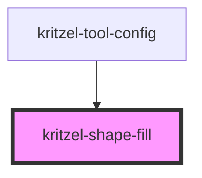

# kritzel-shape-fill

A component for selecting shape fill style (transparent or filled background).

<!-- Auto Generated Below -->

## Properties

| Property | Attribute | Description       | Type                        | Default         |
| -------- | --------- | ----------------- | --------------------------- | --------------- |
| `value`  | `value`   | Current fill type | `"filled" \| "transparent"` | `'transparent'` |

## Events

| Event         | Description | Type                                     |
| ------------- | ----------- | ---------------------------------------- |
| `valueChange` |             | `CustomEvent<"filled" \| "transparent">` |

## Dependencies

### Used by

 - [kritzel-tool-config](../kritzel-tool-config)

### Graph

----------------------------------------------

*Built with [StencilJS](https://stenciljs.com/)*
