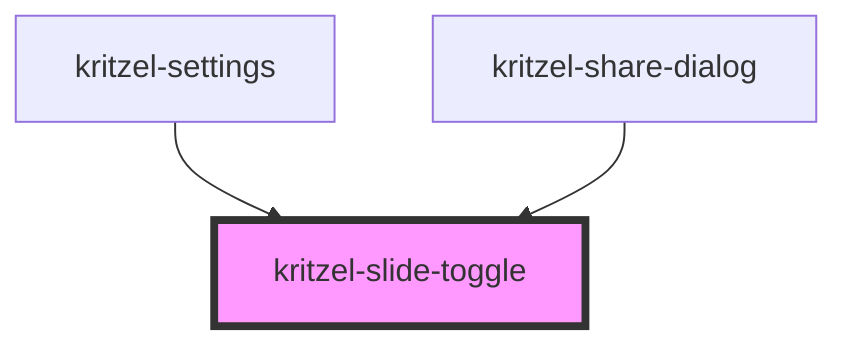

# kritzel-slide-toggle

A slide toggle (switch) component for toggling between on/off states.

## Usage

```html
<kritzel-slide-toggle></kritzel-slide-toggle>

<!-- With initial checked state -->
<kritzel-slide-toggle checked></kritzel-slide-toggle>

<!-- Disabled state -->
<kritzel-slide-toggle disabled></kritzel-slide-toggle>

<!-- With accessibility label -->
<kritzel-slide-toggle label="Enable notifications"></kritzel-slide-toggle>
```

## CSS Variables

| Variable | Description | Default |
|----------|-------------|---------|
| `--kritzel-slide-toggle-width` | Width of the toggle track | `40px` |
| `--kritzel-slide-toggle-height` | Height of the toggle track | `22px` |
| `--kritzel-slide-toggle-track-color` | Background color of the track (off state) | `#ccc` |
| `--kritzel-slide-toggle-track-checked-color` | Background color of the track (on state) | `#4caf50` |
| `--kritzel-slide-toggle-thumb-color` | Color of the thumb | `#fff` |
| `--kritzel-slide-toggle-thumb-size` | Size of the thumb | `18px` |
| `--kritzel-slide-toggle-border-radius` | Border radius of the track | `11px` |
| `--kritzel-slide-toggle-transition-duration` | Duration of the toggle animation | `0.2s` |

<!-- Auto Generated Below -->


## Properties

| Property   | Attribute  | Description                                   | Type      | Default     |
| ---------- | ---------- | --------------------------------------------- | --------- | ----------- |
| `checked`  | `checked`  | Whether the toggle is checked/on              | `boolean` | `false`     |
| `disabled` | `disabled` | Whether the toggle is disabled                | `boolean` | `false`     |
| `label`    | `label`    | Label text for accessibility (screen readers) | `string`  | `undefined` |


## Events

| Event           | Description                           | Type                   |
| --------------- | ------------------------------------- | ---------------------- |
| `checkedChange` | Emitted when the toggle state changes | `CustomEvent<boolean>` |


## Dependencies

### Used by

 - [kritzel-settings](../kritzel-settings)
 - [kritzel-share-dialog](../kritzel-share-dialog)

### Graph


----------------------------------------------

*Built with [StencilJS](https://stenciljs.com/)*
