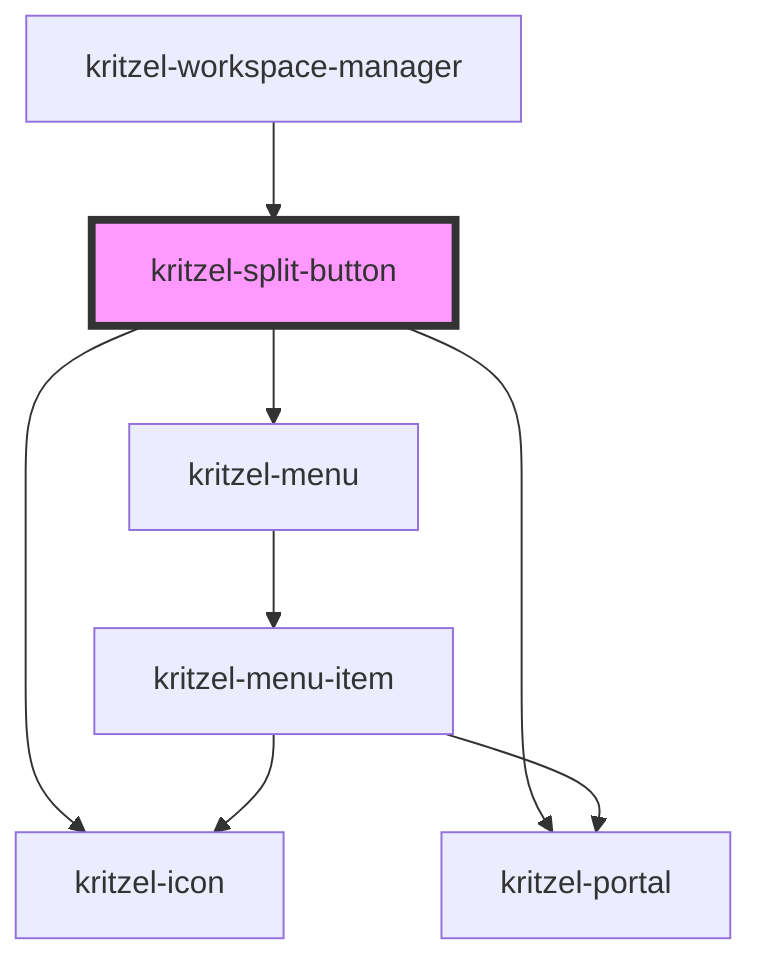

# kritzel-split-button

<!-- Auto Generated Below -->

## Properties

| Property             | Attribute              | Description | Type                      | Default         |
| -------------------- | ---------------------- | ----------- | ------------------------- | --------------- |
| `buttonIcon`         | `button-icon`          |             | `string`                  | `'plus'`        |
| `dropdownIcon`       | `dropdown-icon`        |             | `string`                  | `'chevronDown'` |
| `items`              | --                     |             | `IKritzelMenuItem<any>[]` | `[]`            |
| `mainButtonDisabled` | `main-button-disabled` |             | `boolean`                 | `false`         |
| `menuButtonDisabled` | `menu-button-disabled` |             | `boolean`                 | `false`         |

## Events

| Event                 | Description | Type                                                |
| --------------------- | ----------- | --------------------------------------------------- |
| `itemCancel`          |             | `CustomEvent<IKritzelMenuItem<any>>`                |
| `itemCloseChildMenu`  |             | `CustomEvent<IKritzelMenuItem<any>>`                |
| `itemSave`            |             | `CustomEvent<IKritzelMenuItem<any>>`                |
| `itemSelect`          |             | `CustomEvent<IKritzelMenuItemSelectEvent>`          |
| `itemToggleChildMenu` |             | `CustomEvent<IKritzelMenuItemToggleChildMenuEvent>` |
| `mainButtonClick`     |             | `CustomEvent<void>`                                 |
| `menuClose`           |             | `CustomEvent<void>`                                 |
| `menuOpen`            |             | `CustomEvent<void>`                                 |

## Methods

### `close() => Promise<void>`

#### Returns

Type: `Promise<void>`

### `focusMenu() => Promise<void>`

#### Returns

Type: `Promise<void>`

### `open() => Promise<void>`

#### Returns

Type: `Promise<void>`

## Dependencies

### Used by

 - [kritzel-workspace-manager](../kritzel-workspace-manager)

### Depends on

- kritzel-icon
- [kritzel-portal](../kritzel-portal)
- [kritzel-menu](../kritzel-menu)

### Graph

----------------------------------------------

*Built with [StencilJS](https://stenciljs.com/)*
