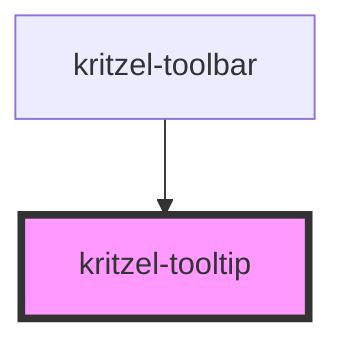

# kritzel-tooltip

<!-- Auto Generated Below -->

## Properties

| Property         | Attribute    | Description | Type          | Default     |
| ---------------- | ------------ | ----------- | ------------- | ----------- |
| `anchorElement`  | --           |             | `HTMLElement` | `undefined` |
| `isVisible`      | `is-visible` |             | `boolean`     | `false`     |
| `offsetY`        | `offset-y`   |             | `number`      | `24`        |
| `triggerElement` | --           |             | `HTMLElement` | `undefined` |

## Events

| Event           | Description | Type                |
| --------------- | ----------- | ------------------- |
| `tooltipClosed` |             | `CustomEvent<void>` |
| `tooltipOpened` |             | `CustomEvent<void>` |

## Methods

### `close() => Promise<void>`

#### Returns

Type: `Promise<void>`

### `focusContent() => Promise<void>`

#### Returns

Type: `Promise<void>`

### `open() => Promise<void>`

#### Returns

Type: `Promise<void>`

### `toggle() => Promise<void>`

#### Returns

Type: `Promise<void>`

## Slots

| Slot | Description      |
| ---- | ---------------- |
|      | The default slot |

## Dependencies

### Used by

 - [kritzel-toolbar](../kritzel-toolbar)

### Graph

----------------------------------------------

*Built with [StencilJS](https://stenciljs.com/)*
