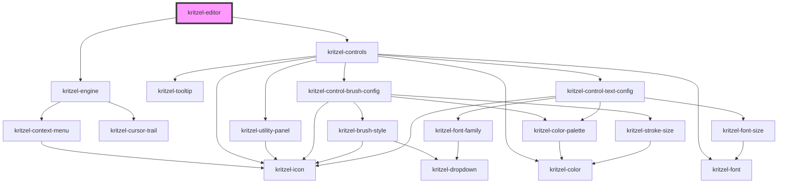

# kritzel-editor

<!-- Auto Generated Below -->

## Properties

| Property         | Attribute          | Description | Type                       | Default                    |
| ---------------- | ------------------ | ----------- | -------------------------- | -------------------------- |
| `controls`       | `controls`         |             | `KritzelToolbarControl[]`  | `DEFAULT_KRITZEL_CONTROLS` |
| `customSvgIcons` | `custom-svg-icons` |             | `{ [x: string]: string; }` | `{}`                       |
| `hideControls`   | `hide-controls`    |             | `boolean`                  | `false`                    |

## Events

| Event     | Description | Type                       |
| --------- | ----------- | -------------------------- |
| `isReady` |             | `CustomEvent<HTMLElement>` |

## Methods

### `addObject<T extends KritzelBaseObject>(object: T) => Promise<T | null>`

#### Parameters

| Name     | Type | Description |
| -------- | ---- | ----------- |
| `object` | `T`  |             |

#### Returns

Type: `Promise<T>`

### `clearSelection() => Promise<void>`

#### Returns

Type: `Promise<void>`

### `getObjectById<T extends KritzelBaseObject>(id: string) => Promise<T | null>`

#### Parameters

| Name | Type     | Description |
| ---- | -------- | ----------- |
| `id` | `string` |             |

#### Returns

Type: `Promise<T>`

### `getSelectedObjects() => Promise<KritzelBaseObject[]>`

#### Returns

Type: `Promise<KritzelBaseObject<HTMLElement>[]>`

### `removeObject<T extends KritzelBaseObject>(object: T) => Promise<T | null>`

#### Parameters

| Name     | Type | Description |
| -------- | ---- | ----------- |
| `object` | `T`  |             |

#### Returns

Type: `Promise<T>`

### `selectAllObjectsInViewport() => Promise<void>`

#### Returns

Type: `Promise<void>`

### `selectObjects(objects: KritzelBaseObject[]) => Promise<void>`

#### Parameters

| Name      | Type                               | Description |
| --------- | ---------------------------------- | ----------- |
| `objects` | `KritzelBaseObject<HTMLElement>[]` |             |

#### Returns

Type: `Promise<void>`

### `updateObject<T extends KritzelBaseObject>(object: T, updatedProperties: Partial<T>) => Promise<T | null>`

#### Parameters

| Name                | Type                         | Description |
| ------------------- | ---------------------------- | ----------- |
| `object`            | `T`                          |             |
| `updatedProperties` | `{ [P in keyof T]?: T[P]; }` |             |

#### Returns

Type: `Promise<T>`

## Dependencies

### Depends on

- [kritzel-engine](../kritzel-engine)
- [kritzel-controls](../../ui/kritzel-controls)

### Graph

----------------------------------------------

*Built with [StencilJS](https://stenciljs.com/)*
