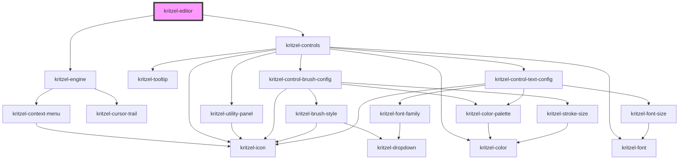

# kritzel-editor

<!-- Auto Generated Below -->

## Properties

| Property                 | Attribute                   | Description | Type                       | Default                                                                                                                                                                                                                                                                                                                                                                                                                                                                                                                                                                                                                                                                                                                                                                                                                                                                                                                    |
| ------------------------ | --------------------------- | ----------- | -------------------------- | -------------------------------------------------------------------------------------------------------------------------------------------------------------------------------------------------------------------------------------------------------------------------------------------------------------------------------------------------------------------------------------------------------------------------------------------------------------------------------------------------------------------------------------------------------------------------------------------------------------------------------------------------------------------------------------------------------------------------------------------------------------------------------------------------------------------------------------------------------------------------------------------------------------------------- |
| `controls`               | `controls`                  |             | `KritzelToolbarControl[]`  | `[     {       name: 'selection',       type: 'tool',       tool: KritzelSelectionTool,       icon: 'cursor',     },     {       name: 'brush',       type: 'tool',       tool: KritzelBrushTool,       isDefault: true,       icon: 'pen',       config: DEFAULT_BRUSH_CONFIG,     },     {       name: 'eraser',       type: 'tool',       tool: KritzelEraserTool,       icon: 'eraser',     },     {       name: 'text',       type: 'tool',       tool: KritzelTextTool,       icon: 'type',       config: DEFAULT_TEXT_CONFIG,     },     {       name: 'image',       type: 'tool',       tool: KritzelImageTool,       icon: 'image',     },     {       name: 'divider',       type: 'divider',     },     {       name: 'config',       type: 'config',     },   ]`                                                                                                                                              |
| `customSvgIcons`         | `custom-svg-icons`          |             | `{ [x: string]: string; }` | `{}`                                                                                                                                                                                                                                                                                                                                                                                                                                                                                                                                                                                                                                                                                                                                                                                                                                                                                                                       |
| `globalContextMenuItems` | `global-context-menu-items` |             | `ContextMenuItem[]`        | `[     {       label: 'Paste',       icon: 'paste',       disabled: async () => (await this.engineRef.getCopiedObjects()).length === 0,       action: menu => this.engineRef.paste(menu.x, menu.y),     },     { label: 'Select All', icon: 'select-all', action: () => this.selectAllObjectsInViewport() },   ]`                                                                                                                                                                                                                                                                                                                                                                                                                                                                                                                                                                                                          |
| `isControlsVisible`      | `is-controls-visible`       |             | `boolean`                  | `true`                                                                                                                                                                                                                                                                                                                                                                                                                                                                                                                                                                                                                                                                                                                                                                                                                                                                                                                     |
| `isUtilityPanelVisible`  | `is-utility-panel-visible`  |             | `boolean`                  | `true`                                                                                                                                                                                                                                                                                                                                                                                                                                                                                                                                                                                                                                                                                                                                                                                                                                                                                                                     |
| `objectContextMenuItems` | `object-context-menu-items` |             | `ContextMenuItem[]`        | `[     {       label: 'Edit',       icon: 'pen',       visible: (_, objects) => objects.length === 1 && objects[0].isEditable,       action: (_, objects) => {         if (objects.length === 1) {           const object = objects[0];           if (object.isEditable) {             object.edit();           }         }       }     },     { label: 'Copy', icon: 'copy', action: () => this.engineRef.copy() },     {       label: 'Paste',       icon: 'paste',       disabled: async () => (await this.engineRef.getCopiedObjects()).length === 0,       action: (menu, _) => this.engineRef.paste(menu.x, menu.y)     },     { label: 'Delete', icon: 'delete', action: () => this.engineRef.delete() },     { label: 'Bring to Front', icon: 'bring-to-front', action: () => this.engineRef.moveToTop() },     { label: 'Send to Back', icon: 'send-to-back', action: () => this.engineRef.moveToBottom() },   ]` |
| `scaleMax`               | `scale-max`                 |             | `number`                   | `ABSOLUTE_SCALE_MAX`                                                                                                                                                                                                                                                                                                                                                                                                                                                                                                                                                                                                                                                                                                                                                                                                                                                                                                       |
| `scaleMin`               | `scale-min`                 |             | `number`                   | `ABSOLUTE_SCALE_MIN`                                                                                                                                                                                                                                                                                                                                                                                                                                                                                                                                                                                                                                                                                                                                                                                                                                                                                                       |

## Events

| Event     | Description | Type                       |
| --------- | ----------- | -------------------------- |
| `isReady` |             | `CustomEvent<HTMLElement>` |

## Methods

### `addObject<T extends KritzelBaseObject>(object: T) => Promise<T | null>`

#### Parameters

| Name     | Type | Description |
| -------- | ---- | ----------- |
| `object` | `T`  |             |

#### Returns

Type: `Promise<T>`

### `centerObjectInViewport(object: KritzelBaseObject) => Promise<KritzelBaseObject<HTMLElement | SVGElement>>`

#### Parameters

| Name     | Type                                           | Description |
| -------- | ---------------------------------------------- | ----------- |
| `object` | `KritzelBaseObject<HTMLElement \| SVGElement>` |             |

#### Returns

Type: `Promise<KritzelBaseObject<HTMLElement | SVGElement>>`

### `clearSelection() => Promise<void>`

#### Returns

Type: `Promise<void>`

### `getObjectById<T extends KritzelBaseObject>(id: string) => Promise<T | null>`

#### Parameters

| Name | Type     | Description |
| ---- | -------- | ----------- |
| `id` | `string` |             |

#### Returns

Type: `Promise<T>`

### `getSelectedObjects() => Promise<KritzelBaseObject[]>`

#### Returns

Type: `Promise<KritzelBaseObject<HTMLElement | SVGElement>[]>`

### `removeObject<T extends KritzelBaseObject>(object: T) => Promise<T | null>`

#### Parameters

| Name     | Type | Description |
| -------- | ---- | ----------- |
| `object` | `T`  |             |

#### Returns

Type: `Promise<T>`

### `selectAllObjectsInViewport() => Promise<void>`

#### Returns

Type: `Promise<void>`

### `selectObjects(objects: KritzelBaseObject[]) => Promise<void>`

#### Parameters

| Name      | Type                                             | Description |
| --------- | ------------------------------------------------ | ----------- |
| `objects` | `KritzelBaseObject<HTMLElement \| SVGElement>[]` |             |

#### Returns

Type: `Promise<void>`

### `updateObject<T extends KritzelBaseObject>(object: T, updatedProperties: Partial<T>) => Promise<T | null>`

#### Parameters

| Name                | Type                         | Description |
| ------------------- | ---------------------------- | ----------- |
| `object`            | `T`                          |             |
| `updatedProperties` | `{ [P in keyof T]?: T[P]; }` |             |

#### Returns

Type: `Promise<T>`

## Dependencies

### Depends on

- [kritzel-engine](../kritzel-engine)
- [kritzel-controls](../../ui/kritzel-controls)

### Graph

----------------------------------------------

*Built with [StencilJS](https://stenciljs.com/)*
