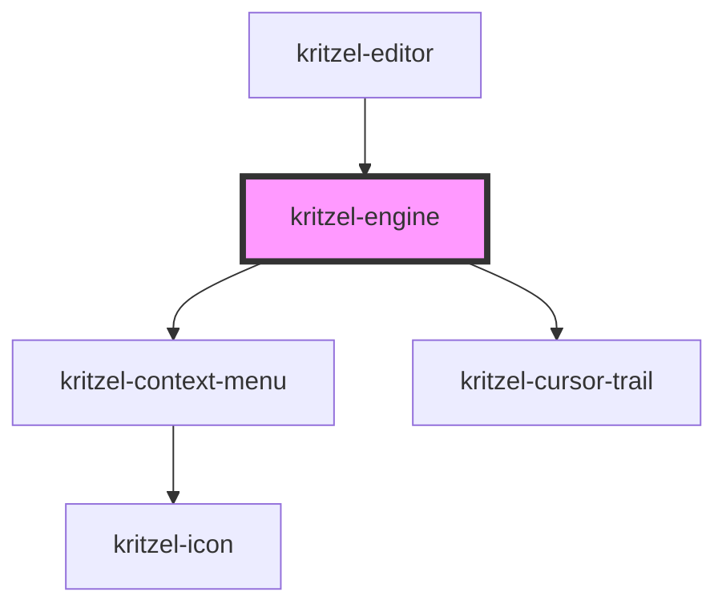

# kritzel-engine

<!-- Auto Generated Below -->

## Properties

| Property                 | Attribute                   | Description | Type                | Default                                                                                                                                                                                                                                                                                                                                                                                                                                                                                                                                                                                                                                                                                                                              |
| ------------------------ | --------------------------- | ----------- | ------------------- | ------------------------------------------------------------------------------------------------------------------------------------------------------------------------------------------------------------------------------------------------------------------------------------------------------------------------------------------------------------------------------------------------------------------------------------------------------------------------------------------------------------------------------------------------------------------------------------------------------------------------------------------------------------------------------------------------------------------------------------ |
| `activeTool`             | `active-tool`               |             | `KritzelTool`       | `undefined`                                                                                                                                                                                                                                                                                                                                                                                                                                                                                                                                                                                                                                                                                                                          |
| `globalContextMenuItems` | `global-context-menu-items` |             | `ContextMenuItem[]` | `[     {       label: 'Paste',       icon: 'paste',       disabled: () => this.store.state.copiedObjects === null,       action: () => {         const x = (-this.store.state.translateX + this.store.state.contextMenuX) / this.store.state.scale;         const y = (-this.store.state.translateY + this.store.state.contextMenuY) / this.store.state.scale;         this.paste(x, y);       },     },     { label: 'Select All', icon: 'select-all', action: () => this.selectAllObjectsInViewport() },   ]`                                                                                                                                                                                                                             |
| `objectContextMenuItems` | `object-context-menu-items` |             | `ContextMenuItem[]` | `[     { label: 'Copy', icon: 'copy', action: () => this.copy() },     {       label: 'Paste',       icon: 'paste',       disabled: () => this.store.state.copiedObjects === null,       action: () => {         const x = (-this.store.state.translateX + this.store.state.contextMenuX) / this.store.state.scale;         const y = (-this.store.state.translateY + this.store.state.contextMenuY) / this.store.state.scale;         this.paste(x, y);       },     },     { label: 'Delete', icon: 'delete', action: () => this.delete() },     { label: 'Bring to Front', icon: 'bring-to-front', action: () => this.moveToTop() },     { label: 'Send to Back', icon: 'send-to-back', action: () => this.moveToBottom() },   ]` |

## Events

| Event              | Description | Type                           |
| ------------------ | ----------- | ------------------------------ |
| `activeToolChange` |             | `CustomEvent<KritzelBaseTool>` |
| `engineReady`      |             | `CustomEvent<void>`            |

## Methods

### `changeActiveTool(tool: KritzelBaseTool) => Promise<void>`

#### Parameters

| Name   | Type              | Description |
| ------ | ----------------- | ----------- |
| `tool` | `KritzelBaseTool` |             |

#### Returns

Type: `Promise<void>`

### `copy() => Promise<void>`

#### Returns

Type: `Promise<void>`

### `delete() => Promise<void>`

#### Returns

Type: `Promise<void>`

### `disable() => Promise<void>`

#### Returns

Type: `Promise<void>`

### `enable() => Promise<void>`

#### Returns

Type: `Promise<void>`

### `hideContextMenu() => Promise<void>`

#### Returns

Type: `Promise<void>`

### `moveToBottom() => Promise<void>`

#### Returns

Type: `Promise<void>`

### `moveToTop() => Promise<void>`

#### Returns

Type: `Promise<void>`

### `paste(x: number, y: number) => Promise<void>`

#### Parameters

| Name | Type     | Description |
| ---- | -------- | ----------- |
| `x`  | `number` |             |
| `y`  | `number` |             |

#### Returns

Type: `Promise<void>`

### `redo() => Promise<void>`

#### Returns

Type: `Promise<void>`

### `registerTool(toolName: string, toolClass: any, toolConfig?: KritzelTextToolConfig | KritzelBrushToolConfig) => Promise<KritzelBaseTool>`

#### Parameters

| Name         | Type                                              | Description |
| ------------ | ------------------------------------------------- | ----------- |
| `toolName`   | `string`                                          |             |
| `toolClass`  | `any`                                             |             |
| `toolConfig` | `KritzelTextToolConfig \| KritzelBrushToolConfig` |             |

#### Returns

Type: `Promise<KritzelBaseTool>`

### `selectAllObjectsInViewport() => Promise<void>`

#### Returns

Type: `Promise<void>`

### `setFocus() => Promise<void>`

#### Returns

Type: `Promise<void>`

### `undo() => Promise<void>`

#### Returns

Type: `Promise<void>`

## Dependencies

### Used by

 - [kritzel-editor](../kritzel-editor)

### Depends on

- [kritzel-context-menu](../../ui/kritzel-context-menu)
- [kritzel-cursor-trail](../kritzel-cursor-trail)

### Graph

----------------------------------------------

*Built with [StencilJS](https://stenciljs.com/)*
