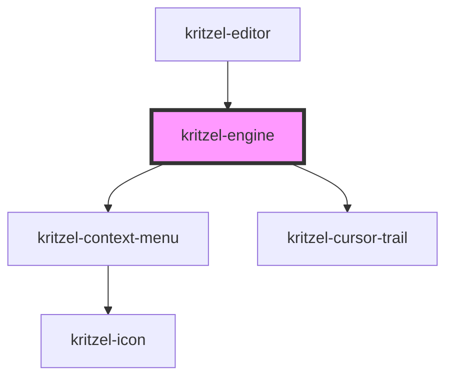

# kritzel-engine

<!-- Auto Generated Below -->

## Properties

| Property                 | Attribute                   | Description | Type                | Default              |
| ------------------------ | --------------------------- | ----------- | ------------------- | -------------------- |
| `activeTool`             | `active-tool`               |             | `KritzelTool`       | `undefined`          |
| `globalContextMenuItems` | `global-context-menu-items` |             | `ContextMenuItem[]` | `undefined`          |
| `objectContextMenuItems` | `object-context-menu-items` |             | `ContextMenuItem[]` | `undefined`          |
| `scaleMax`               | `scale-max`                 |             | `number`            | `ABSOLUTE_SCALE_MAX` |
| `scaleMin`               | `scale-min`                 |             | `number`            | `ABSOLUTE_SCALE_MIN` |

## Events

| Event              | Description | Type                           |
| ------------------ | ----------- | ------------------------------ |
| `activeToolChange` |             | `CustomEvent<KritzelBaseTool>` |
| `isEngineReady`    |             | `CustomEvent<void>`            |

## Methods

### `addObject<T extends KritzelBaseObject>(object: T) => Promise<T | null>`

#### Parameters

| Name     | Type | Description |
| -------- | ---- | ----------- |
| `object` | `T`  |             |

#### Returns

Type: `Promise<T>`

### `bringForward(object?: KritzelBaseObject<any>) => Promise<void>`

#### Parameters

| Name     | Type                     | Description |
| -------- | ------------------------ | ----------- |
| `object` | `KritzelBaseObject<any>` |             |

#### Returns

Type: `Promise<void>`

### `centerObjectInViewport(object: KritzelBaseObject) => Promise<KritzelBaseObject<HTMLElement | SVGElement>>`

#### Parameters

| Name     | Type                                           | Description |
| -------- | ---------------------------------------------- | ----------- |
| `object` | `KritzelBaseObject<HTMLElement \| SVGElement>` |             |

#### Returns

Type: `Promise<KritzelBaseObject<HTMLElement | SVGElement>>`

### `changeActiveTool(tool: KritzelBaseTool) => Promise<void>`

#### Parameters

| Name   | Type              | Description |
| ------ | ----------------- | ----------- |
| `tool` | `KritzelBaseTool` |             |

#### Returns

Type: `Promise<void>`

### `clearSelection() => Promise<void>`

#### Returns

Type: `Promise<void>`

### `copy() => Promise<void>`

#### Returns

Type: `Promise<void>`

### `delete() => Promise<void>`

#### Returns

Type: `Promise<void>`

### `disable() => Promise<void>`

#### Returns

Type: `Promise<void>`

### `enable() => Promise<void>`

#### Returns

Type: `Promise<void>`

### `getCopiedObjects() => Promise<KritzelBaseObject[]>`

#### Returns

Type: `Promise<KritzelBaseObject<HTMLElement | SVGElement>[]>`

### `getObjectById<T extends KritzelBaseObject>(id: string) => Promise<T | null>`

#### Parameters

| Name | Type     | Description |
| ---- | -------- | ----------- |
| `id` | `string` |             |

#### Returns

Type: `Promise<T>`

### `getSelectedObjects() => Promise<KritzelBaseObject<any>[]>`

#### Returns

Type: `Promise<KritzelBaseObject<any>[]>`

### `hideContextMenu() => Promise<void>`

#### Returns

Type: `Promise<void>`

### `moveToBottom(object?: KritzelBaseObject<any>) => Promise<void>`

#### Parameters

| Name     | Type                     | Description |
| -------- | ------------------------ | ----------- |
| `object` | `KritzelBaseObject<any>` |             |

#### Returns

Type: `Promise<void>`

### `moveToTop(object?: KritzelBaseObject<any>) => Promise<void>`

#### Parameters

| Name     | Type                     | Description |
| -------- | ------------------------ | ----------- |
| `object` | `KritzelBaseObject<any>` |             |

#### Returns

Type: `Promise<void>`

### `paste(x: number, y: number) => Promise<void>`

#### Parameters

| Name | Type     | Description |
| ---- | -------- | ----------- |
| `x`  | `number` |             |
| `y`  | `number` |             |

#### Returns

Type: `Promise<void>`

### `redo() => Promise<void>`

#### Returns

Type: `Promise<void>`

### `registerTool(toolName: string, toolClass: any, toolConfig?: KritzelTextToolConfig | KritzelBrushToolConfig) => Promise<KritzelBaseTool>`

#### Parameters

| Name         | Type                                              | Description |
| ------------ | ------------------------------------------------- | ----------- |
| `toolName`   | `string`                                          |             |
| `toolClass`  | `any`                                             |             |
| `toolConfig` | `KritzelTextToolConfig \| KritzelBrushToolConfig` |             |

#### Returns

Type: `Promise<KritzelBaseTool>`

### `removeObject<T extends KritzelBaseObject>(object: T) => Promise<T | null>`

#### Parameters

| Name     | Type | Description |
| -------- | ---- | ----------- |
| `object` | `T`  |             |

#### Returns

Type: `Promise<T>`

### `selectAllObjectsInViewport() => Promise<void>`

#### Returns

Type: `Promise<void>`

### `selectObjects(objects: KritzelBaseObject[]) => Promise<void>`

#### Parameters

| Name      | Type                                             | Description |
| --------- | ------------------------------------------------ | ----------- |
| `objects` | `KritzelBaseObject<HTMLElement \| SVGElement>[]` |             |

#### Returns

Type: `Promise<void>`

### `sendBackward(object?: KritzelBaseObject<any>) => Promise<void>`

#### Parameters

| Name     | Type                     | Description |
| -------- | ------------------------ | ----------- |
| `object` | `KritzelBaseObject<any>` |             |

#### Returns

Type: `Promise<void>`

### `setFocus() => Promise<void>`

#### Returns

Type: `Promise<void>`

### `undo() => Promise<void>`

#### Returns

Type: `Promise<void>`

### `updateObject<T extends KritzelBaseObject>(object: T, updatedProperties: Partial<T>) => Promise<T | null>`

#### Parameters

| Name                | Type                         | Description |
| ------------------- | ---------------------------- | ----------- |
| `object`            | `T`                          |             |
| `updatedProperties` | `{ [P in keyof T]?: T[P]; }` |             |

#### Returns

Type: `Promise<T>`

## Dependencies

### Used by

 - [kritzel-editor](../kritzel-editor)

### Depends on

- [kritzel-context-menu](../../ui/kritzel-context-menu)
- [kritzel-cursor-trail](../kritzel-cursor-trail)

### Graph

----------------------------------------------

*Built with [StencilJS](https://stenciljs.com/)*
