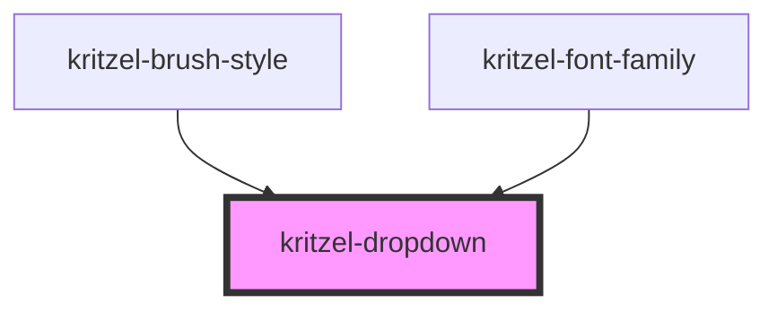

# kritzel-dropdown

<!-- Auto Generated Below -->

## Properties

| Property       | Attribute       | Description | Type               | Default     |
| -------------- | --------------- | ----------- | ------------------ | ----------- |
| `options`      | `options`       |             | `DropdownOption[]` | `[]`        |
| `selectStyles` | `select-styles` |             | `any`              | `{}`        |
| `value`        | `value`         |             | `string`           | `undefined` |
| `width`        | `width`         |             | `string`           | `undefined` |

## Events

| Event          | Description | Type                  |
| -------------- | ----------- | --------------------- |
| `valueChanged` |             | `CustomEvent<string>` |

## Dependencies

### Used by

 - [kritzel-brush-style](../kritzel-brush-style)
 - [kritzel-font-family](../kritzel-font-family)

### Graph

----------------------------------------------

*Built with [StencilJS](https://stenciljs.com/)*
