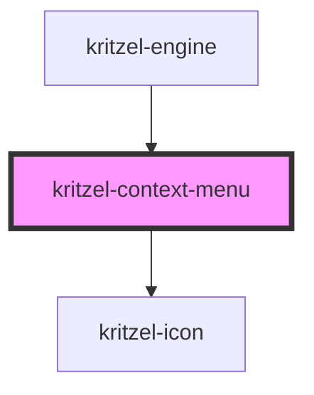

# kritzel-context-menu

<!-- Auto Generated Below -->

## Properties

| Property | Attribute | Description | Type                | Default     |
| -------- | --------- | ----------- | ------------------- | ----------- |
| `items`  | `items`   |             | `ContextMenuItem[]` | `undefined` |

## Events

| Event            | Description | Type                           |
| ---------------- | ----------- | ------------------------------ |
| `actionSelected` |             | `CustomEvent<ContextMenuItem>` |
| `close`          |             | `CustomEvent<void>`            |

## Dependencies

### Used by

 - [kritzel-engine](../../core/kritzel-engine)

### Depends on

- [kritzel-icon](../../shared/kritzel-icon)

### Graph

----------------------------------------------

*Built with [StencilJS](https://stenciljs.com/)*
