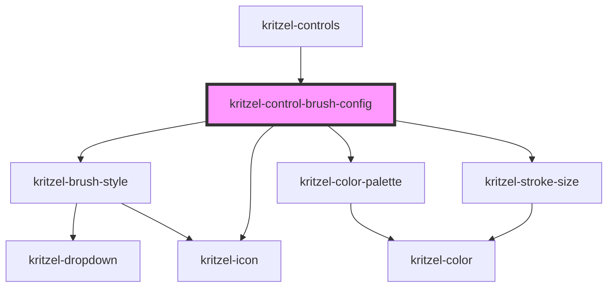

# kritzel-control-brush-config

<!-- Auto Generated Below -->

## Properties

| Property     | Attribute     | Description | Type               | Default     |
| ------------ | ------------- | ----------- | ------------------ | ----------- |
| `isExpanded` | `is-expanded` |             | `boolean`          | `false`     |
| `tool`       | `tool`        |             | `KritzelBrushTool` | `undefined` |

## Events

| Event        | Description | Type                            |
| ------------ | ----------- | ------------------------------- |
| `toolChange` |             | `CustomEvent<KritzelBrushTool>` |

## Dependencies

### Used by

 - [kritzel-controls](../kritzel-controls)

### Depends on

- [kritzel-brush-style](../../shared/kritzel-brush-style)
- [kritzel-icon](../../shared/kritzel-icon)
- [kritzel-color-palette](../../shared/kritzel-color-palette)
- [kritzel-stroke-size](../../shared/kritzel-stroke-size)

### Graph

----------------------------------------------

*Built with [StencilJS](https://stenciljs.com/)*
