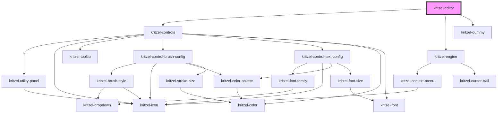

# kritzel-editor

<!-- Auto Generated Below -->

## Properties

| Property         | Attribute          | Description | Type                       | Default                    |
| ---------------- | ------------------ | ----------- | -------------------------- | -------------------------- |
| `controls`       | `controls`         |             | `KritzelToolbarControl[]`  | `DEFAULT_KRITZEL_CONTROLS` |
| `customSvgIcons` | `custom-svg-icons` |             | `{ [x: string]: string; }` | `{}`                       |
| `hideControls`   | `hide-controls`    |             | `boolean`                  | `false`                    |

## Dependencies

### Depends on

- [kritzel-controls](../../ui/kritzel-controls)
- [kritzel-engine](../kritzel-engine)
- [kritzel-dummy](../../ui/kritzel-dummy)

### Graph

----------------------------------------------

*Built with [StencilJS](https://stenciljs.com/)*
