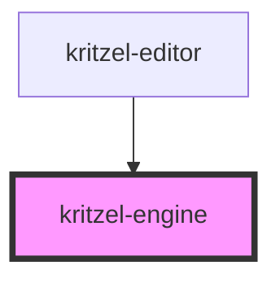

# kritzel-engine

<!-- Auto Generated Below -->

## Properties

| Property     | Attribute     | Description | Type          | Default     |
| ------------ | ------------- | ----------- | ------------- | ----------- |
| `activeTool` | `active-tool` |             | `KritzelTool` | `undefined` |

## Methods

### `changeActiveTool(tool: string) => Promise<void>`

#### Parameters

| Name   | Type     | Description |
| ------ | -------- | ----------- |
| `tool` | `string` |             |

#### Returns

Type: `Promise<void>`

## Dependencies

### Used by

 - [kritzel-editor](../kritzel-editor)

### Graph

----------------------------------------------

*Built with [StencilJS](https://stenciljs.com/)*
