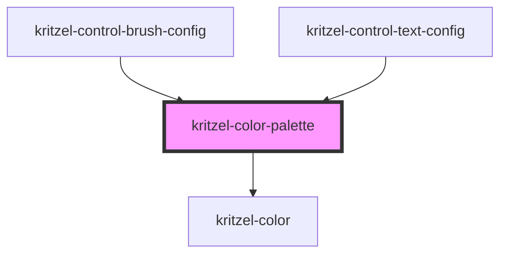

# kritzel-color-palette

<!-- Auto Generated Below -->

## Properties

| Property        | Attribute        | Description | Type       | Default |
| --------------- | ---------------- | ----------- | ---------- | ------- |
| `colors`        | `colors`         |             | `string[]` | `[]`    |
| `isExpanded`    | `is-expanded`    |             | `boolean`  | `false` |
| `isOpaque`      | `is-opaque`      |             | `boolean`  | `false` |
| `selectedColor` | `selected-color` |             | `string`   | `null`  |

## Events

| Event         | Description | Type                  |
| ------------- | ----------- | --------------------- |
| `colorChange` |             | `CustomEvent<string>` |

## Dependencies

### Used by

 - [kritzel-control-brush-config](../../ui/kritzel-control-brush-config)
 - [kritzel-control-text-config](../../ui/kritzel-control-text-config)

### Depends on

- [kritzel-color](../kritzel-color)

### Graph

----------------------------------------------

*Built with [StencilJS](https://stenciljs.com/)*
