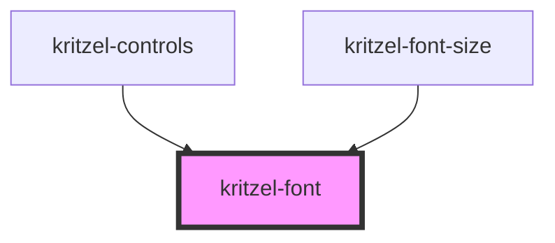

# kritzel-font

<!-- Auto Generated Below -->

## Properties

| Property     | Attribute     | Description | Type     | Default               |
| ------------ | ------------- | ----------- | -------- | --------------------- |
| `color`      | `color`       |             | `string` | `'#000000'`           |
| `fontFamily` | `font-family` |             | `string` | `'Arial, sans-serif'` |
| `size`       | `size`        |             | `number` | `24`                  |

## Dependencies

### Used by

 - [kritzel-controls](../../ui/kritzel-controls)
 - [kritzel-font-size](../kritzel-font-size)

### Graph

----------------------------------------------

*Built with [StencilJS](https://stenciljs.com/)*
