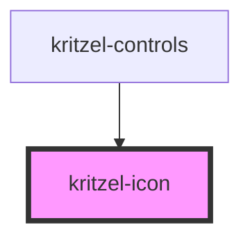

# kritzel-icon

<!-- Auto Generated Below -->

## Properties

| Property | Attribute | Description | Type                                                 | Default     |
| -------- | --------- | ----------- | ---------------------------------------------------- | ----------- |
| `label`  | `label`   |             | `string`                                             | `undefined` |
| `name`   | `name`    |             | `"cursor" \| "eraser" \| "image" \| "pen" \| "type"` | `undefined` |

## Dependencies

### Used by

 - [kritzel-controls](../kritzel-controls)

### Graph

----------------------------------------------

*Built with [StencilJS](https://stenciljs.com/)*
