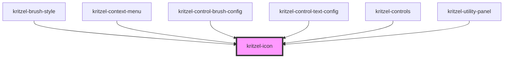

# kritzel-icon

<!-- Auto Generated Below -->

## Properties

| Property | Attribute | Description | Type     | Default     |
| -------- | --------- | ----------- | -------- | ----------- |
| `label`  | `label`   |             | `string` | `undefined` |
| `name`   | `name`    |             | `string` | `undefined` |
| `size`   | `size`    |             | `number` | `24`        |

## Dependencies

### Used by

 - [kritzel-brush-style](../kritzel-brush-style)
 - [kritzel-context-menu](../../ui/kritzel-context-menu)
 - [kritzel-control-brush-config](../../ui/kritzel-control-brush-config)
 - [kritzel-control-text-config](../../ui/kritzel-control-text-config)
 - [kritzel-controls](../../ui/kritzel-controls)
 - [kritzel-utility-panel](../../ui/kritzel-utility-panel)

### Graph

----------------------------------------------

*Built with [StencilJS](https://stenciljs.com/)*
