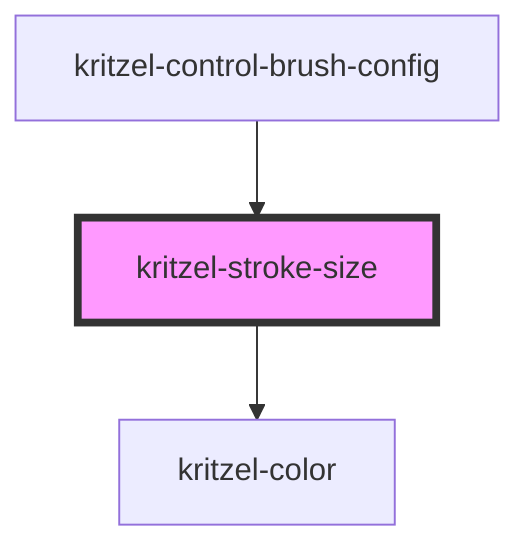

# kritzel-stroke-size

<!-- Auto Generated Below -->

## Properties

| Property       | Attribute       | Description | Type       | Default                 |
| -------------- | --------------- | ----------- | ---------- | ----------------------- |
| `selectedSize` | `selected-size` |             | `number`   | `null`                  |
| `sizes`        | `sizes`         |             | `number[]` | `[4, 6, 8, 12, 16, 24]` |

## Events

| Event        | Description | Type                  |
| ------------ | ----------- | --------------------- |
| `sizeChange` |             | `CustomEvent<number>` |

## Dependencies

### Used by

 - [kritzel-control-brush-config](../../ui/kritzel-control-brush-config)

### Depends on

- [kritzel-color](../kritzel-color)

### Graph

----------------------------------------------

*Built with [StencilJS](https://stenciljs.com/)*
