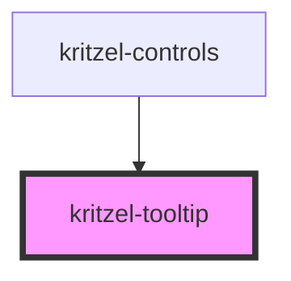

# kritzel-tooltip

<!-- Auto Generated Below -->

## Properties

| Property        | Attribute        | Description | Type          | Default     |
| --------------- | ---------------- | ----------- | ------------- | ----------- |
| `anchorElement` | `anchor-element` |             | `HTMLElement` | `undefined` |
| `arrowSize`     | `arrow-size`     |             | `number`      | `8`         |
| `isVisible`     | `is-visible`     |             | `boolean`     | `false`     |
| `offsetY`       | `offset-y`       |             | `number`      | `24`        |

## Dependencies

### Used by

 - [kritzel-controls](../../ui/kritzel-controls)

### Graph

----------------------------------------------

*Built with [StencilJS](https://stenciljs.com/)*
