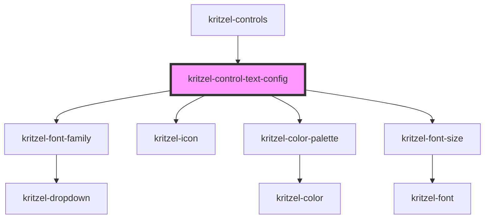

# kritzel-control-text-config

<!-- Auto Generated Below -->

## Properties

| Property     | Attribute     | Description | Type              | Default     |
| ------------ | ------------- | ----------- | ----------------- | ----------- |
| `isExpanded` | `is-expanded` |             | `boolean`         | `false`     |
| `tool`       | `tool`        |             | `KritzelTextTool` | `undefined` |

## Events

| Event        | Description | Type                           |
| ------------ | ----------- | ------------------------------ |
| `toolChange` |             | `CustomEvent<KritzelTextTool>` |

## Dependencies

### Used by

 - [kritzel-controls](../kritzel-controls)

### Depends on

- [kritzel-font-family](../../shared/kritzel-font-family)
- [kritzel-icon](../../shared/kritzel-icon)
- [kritzel-color-palette](../../shared/kritzel-color-palette)
- [kritzel-font-size](../../shared/kritzel-font-size)

### Graph

----------------------------------------------

*Built with [StencilJS](https://stenciljs.com/)*
