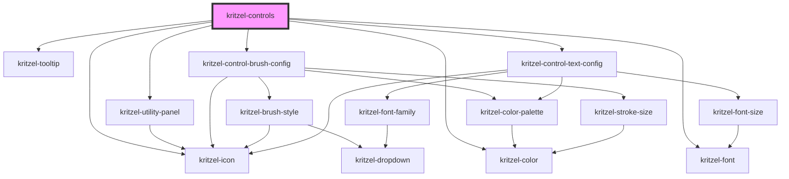

# kritzel-controls

<!-- Auto Generated Below -->

## Properties

| Property        | Attribute        | Description | Type                      | Default |
| --------------- | ---------------- | ----------- | ------------------------- | ------- |
| `activeControl` | `active-control` |             | `KritzelToolbarControl`   | `null`  |
| `controls`      | `controls`       |             | `KritzelToolbarControl[]` | `[]`    |

## Events

| Event           | Description | Type                |
| --------------- | ----------- | ------------------- |
| `controlsReady` |             | `CustomEvent<void>` |

## Dependencies

### Depends on

- [kritzel-utility-panel](../kritzel-utility-panel)
- [kritzel-icon](../../shared/kritzel-icon)
- [kritzel-tooltip](../../shared/kritzel-tooltip)
- [kritzel-control-brush-config](../kritzel-control-brush-config)
- [kritzel-control-text-config](../kritzel-control-text-config)
- [kritzel-color](../../shared/kritzel-color)
- [kritzel-font](../../shared/kritzel-font)

### Graph

----------------------------------------------

*Built with [StencilJS](https://stenciljs.com/)*
